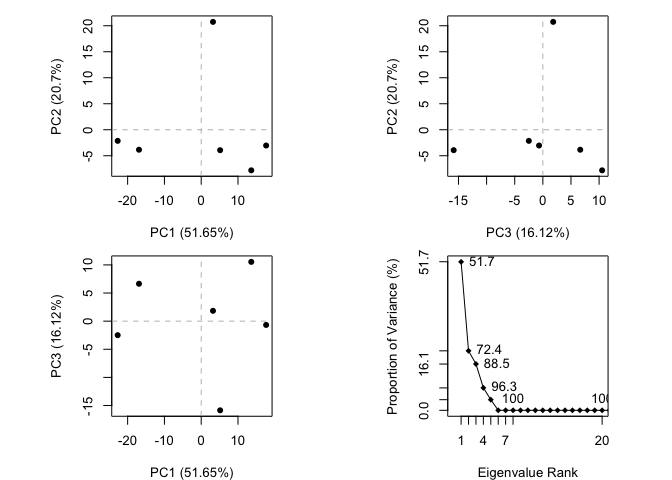

Lecture\_11\_class\_walkthrough
================
LQ
5/8/2019

### *Q1: Download a CSV file from the PDB site (accessible from “Analyze” -&gt; “PDB Statistics” &gt; “by Experimental Method and Molecular Type”. Move this CSV file into your RStudio project and determine the percentage of structures solved by X-Ray and Electron Microscopy. Also can you determine what proportion of structures are protein? Aim to have a rendered GitHub document with working code that yields your answers.*

``` r
db <- read.csv("Data Export Summary.csv")
head(db)
```

    ##   Experimental.Method Proteins Nucleic.Acids Protein.NA.Complex Other
    ## 1               X-Ray   127027          2012               6549     8
    ## 2                 NMR    11064          1279                259     8
    ## 3 Electron Microscopy     2296            31                803     0
    ## 4               Other      256             4                  6    13
    ## 5        Multi Method      131             5                  2     1
    ##    Total
    ## 1 135596
    ## 2  12610
    ## 3   3130
    ## 4    279
    ## 5    139

``` r
#View(db)
```

``` r
#Total number of structures in the PDB database
sum(db$Total)
```

    ## [1] 151754

``` r
#Percent of each experimental method
(db$Total/sum(db$Total))*100
```

    ## [1] 89.35250471  8.30950090  2.06254860  0.18385018  0.09159561

``` r
#What percent are protein
(sum(db$Proteins)/sum(db$Total)) *100
```

    ## [1] 92.76461

### *Q2: Type HIV in the PDB website search box on the home page and determine how many HIV-1 protease structures are in the current PDB?*

#### 1157

Section 3. Using bio3D
----------------------

Let's read the PDB file we downloaded into R to seehow things live in this place

``` r
library(bio3d)
```

``` r
pdb <- read.pdb("1hsg.pdb")
pdb
```

    ## 
    ##  Call:  read.pdb(file = "1hsg.pdb")
    ## 
    ##    Total Models#: 1
    ##      Total Atoms#: 1686,  XYZs#: 5058  Chains#: 2  (values: A B)
    ## 
    ##      Protein Atoms#: 1514  (residues/Calpha atoms#: 198)
    ##      Nucleic acid Atoms#: 0  (residues/phosphate atoms#: 0)
    ## 
    ##      Non-protein/nucleic Atoms#: 172  (residues: 128)
    ##      Non-protein/nucleic resid values: [ HOH (127), MK1 (1) ]
    ## 
    ##    Protein sequence:
    ##       PQITLWQRPLVTIKIGGQLKEALLDTGADDTVLEEMSLPGRWKPKMIGGIGGFIKVRQYD
    ##       QILIEICGHKAIGTVLVGPTPVNIIGRNLLTQIGCTLNFPQITLWQRPLVTIKIGGQLKE
    ##       ALLDTGADDTVLEEMSLPGRWKPKMIGGIGGFIKVRQYDQILIEICGHKAIGTVLVGPTP
    ##       VNIIGRNLLTQIGCTLNF
    ## 
    ## + attr: atom, xyz, seqres, helix, sheet,
    ##         calpha, remark, call

``` r
pdb$seqres
```

    ##     A     A     A     A     A     A     A     A     A     A     A     A 
    ## "PRO" "GLN" "ILE" "THR" "LEU" "TRP" "GLN" "ARG" "PRO" "LEU" "VAL" "THR" 
    ##     A     A     A     A     A     A     A     A     A     A     A     A 
    ## "ILE" "LYS" "ILE" "GLY" "GLY" "GLN" "LEU" "LYS" "GLU" "ALA" "LEU" "LEU" 
    ##     A     A     A     A     A     A     A     A     A     A     A     A 
    ## "ASP" "THR" "GLY" "ALA" "ASP" "ASP" "THR" "VAL" "LEU" "GLU" "GLU" "MET" 
    ##     A     A     A     A     A     A     A     A     A     A     A     A 
    ## "SER" "LEU" "PRO" "GLY" "ARG" "TRP" "LYS" "PRO" "LYS" "MET" "ILE" "GLY" 
    ##     A     A     A     A     A     A     A     A     A     A     A     A 
    ## "GLY" "ILE" "GLY" "GLY" "PHE" "ILE" "LYS" "VAL" "ARG" "GLN" "TYR" "ASP" 
    ##     A     A     A     A     A     A     A     A     A     A     A     A 
    ## "GLN" "ILE" "LEU" "ILE" "GLU" "ILE" "CYS" "GLY" "HIS" "LYS" "ALA" "ILE" 
    ##     A     A     A     A     A     A     A     A     A     A     A     A 
    ## "GLY" "THR" "VAL" "LEU" "VAL" "GLY" "PRO" "THR" "PRO" "VAL" "ASN" "ILE" 
    ##     A     A     A     A     A     A     A     A     A     A     A     A 
    ## "ILE" "GLY" "ARG" "ASN" "LEU" "LEU" "THR" "GLN" "ILE" "GLY" "CYS" "THR" 
    ##     A     A     A     B     B     B     B     B     B     B     B     B 
    ## "LEU" "ASN" "PHE" "PRO" "GLN" "ILE" "THR" "LEU" "TRP" "GLN" "ARG" "PRO" 
    ##     B     B     B     B     B     B     B     B     B     B     B     B 
    ## "LEU" "VAL" "THR" "ILE" "LYS" "ILE" "GLY" "GLY" "GLN" "LEU" "LYS" "GLU" 
    ##     B     B     B     B     B     B     B     B     B     B     B     B 
    ## "ALA" "LEU" "LEU" "ASP" "THR" "GLY" "ALA" "ASP" "ASP" "THR" "VAL" "LEU" 
    ##     B     B     B     B     B     B     B     B     B     B     B     B 
    ## "GLU" "GLU" "MET" "SER" "LEU" "PRO" "GLY" "ARG" "TRP" "LYS" "PRO" "LYS" 
    ##     B     B     B     B     B     B     B     B     B     B     B     B 
    ## "MET" "ILE" "GLY" "GLY" "ILE" "GLY" "GLY" "PHE" "ILE" "LYS" "VAL" "ARG" 
    ##     B     B     B     B     B     B     B     B     B     B     B     B 
    ## "GLN" "TYR" "ASP" "GLN" "ILE" "LEU" "ILE" "GLU" "ILE" "CYS" "GLY" "HIS" 
    ##     B     B     B     B     B     B     B     B     B     B     B     B 
    ## "LYS" "ALA" "ILE" "GLY" "THR" "VAL" "LEU" "VAL" "GLY" "PRO" "THR" "PRO" 
    ##     B     B     B     B     B     B     B     B     B     B     B     B 
    ## "VAL" "ASN" "ILE" "ILE" "GLY" "ARG" "ASN" "LEU" "LEU" "THR" "GLN" "ILE" 
    ##     B     B     B     B     B     B 
    ## "GLY" "CYS" "THR" "LEU" "ASN" "PHE"

``` r
#Shortens sequence to amino acid abbreviations
aa321(pdb$seqres)
```

    ##   [1] "P" "Q" "I" "T" "L" "W" "Q" "R" "P" "L" "V" "T" "I" "K" "I" "G" "G"
    ##  [18] "Q" "L" "K" "E" "A" "L" "L" "D" "T" "G" "A" "D" "D" "T" "V" "L" "E"
    ##  [35] "E" "M" "S" "L" "P" "G" "R" "W" "K" "P" "K" "M" "I" "G" "G" "I" "G"
    ##  [52] "G" "F" "I" "K" "V" "R" "Q" "Y" "D" "Q" "I" "L" "I" "E" "I" "C" "G"
    ##  [69] "H" "K" "A" "I" "G" "T" "V" "L" "V" "G" "P" "T" "P" "V" "N" "I" "I"
    ##  [86] "G" "R" "N" "L" "L" "T" "Q" "I" "G" "C" "T" "L" "N" "F" "P" "Q" "I"
    ## [103] "T" "L" "W" "Q" "R" "P" "L" "V" "T" "I" "K" "I" "G" "G" "Q" "L" "K"
    ## [120] "E" "A" "L" "L" "D" "T" "G" "A" "D" "D" "T" "V" "L" "E" "E" "M" "S"
    ## [137] "L" "P" "G" "R" "W" "K" "P" "K" "M" "I" "G" "G" "I" "G" "G" "F" "I"
    ## [154] "K" "V" "R" "Q" "Y" "D" "Q" "I" "L" "I" "E" "I" "C" "G" "H" "K" "A"
    ## [171] "I" "G" "T" "V" "L" "V" "G" "P" "T" "P" "V" "N" "I" "I" "G" "R" "N"
    ## [188] "L" "L" "T" "Q" "I" "G" "C" "T" "L" "N" "F"

``` r
attributes(pdb)
```

    ## $names
    ## [1] "atom"   "xyz"    "seqres" "helix"  "sheet"  "calpha" "remark" "call"  
    ## 
    ## $class
    ## [1] "pdb" "sse"

``` r
head(pdb$atom)
```

    ##   type eleno elety  alt resid chain resno insert      x      y     z o
    ## 1 ATOM     1     N <NA>   PRO     A     1   <NA> 29.361 39.686 5.862 1
    ## 2 ATOM     2    CA <NA>   PRO     A     1   <NA> 30.307 38.663 5.319 1
    ## 3 ATOM     3     C <NA>   PRO     A     1   <NA> 29.760 38.071 4.022 1
    ## 4 ATOM     4     O <NA>   PRO     A     1   <NA> 28.600 38.302 3.676 1
    ## 5 ATOM     5    CB <NA>   PRO     A     1   <NA> 30.508 37.541 6.342 1
    ## 6 ATOM     6    CG <NA>   PRO     A     1   <NA> 29.296 37.591 7.162 1
    ##       b segid elesy charge
    ## 1 38.10  <NA>     N   <NA>
    ## 2 40.62  <NA>     C   <NA>
    ## 3 42.64  <NA>     C   <NA>
    ## 4 43.40  <NA>     O   <NA>
    ## 5 37.87  <NA>     C   <NA>
    ## 6 38.40  <NA>     C   <NA>

``` r
#Print a subset of $atom data for the first 2 atoms
pdb$atom[1:2, c("eleno", "elety", "x","y","z")]
```

    ##   eleno elety      x      y     z
    ## 1     1     N 29.361 39.686 5.862
    ## 2     2    CA 30.307 38.663 5.319

``` r
# Note that individual $atom records can also be accessed like this
pdb$atom$elety[1:2]
```

    ## [1] "N"  "CA"

``` r
# Which allows us to do the following
plot.bio3d(pdb$atom$b[pdb$calpha], sse=pdb, typ="l", ylab="B-factor")
```


``` r
# Print a summary of the coordinate data in $xyz
pdb$xyz
```

    ## 
    ##    Total Frames#: 1
    ##    Total XYZs#:   5058,  (Atoms#:  1686)
    ## 
    ##     [1]  29.361  39.686  5.862  <...>  30.112  17.912  -4.791  [5058] 
    ## 
    ## + attr: Matrix DIM = 1 x 5058

``` r
# Examine the row and column dimensions
dim(pdb$xyz)
```

    ## [1]    1 5058

``` r
# Print coordinates for the first two atom
pdb$xyz[ 1, atom2xyz(1:2) ]
```

    ## [1] 29.361 39.686  5.862 30.307 38.663  5.319

Section 4: Atom selection examples
----------------------------------

Let's select residue 1

``` r
inds <- atom.select(pdb, resno = 10)
pdb$atom[inds$atom,]
```

    ##     type eleno elety  alt resid chain resno insert      x      y      z o
    ## 81  ATOM    81     N <NA>   LEU     A    10   <NA> 25.905 28.285  9.330 1
    ## 82  ATOM    82    CA <NA>   LEU     A    10   <NA> 25.653 28.510 10.750 1
    ## 83  ATOM    83     C <NA>   LEU     A    10   <NA> 26.383 29.770 11.208 1
    ## 84  ATOM    84     O <NA>   LEU     A    10   <NA> 27.567 29.927 10.938 1
    ## 85  ATOM    85    CB <NA>   LEU     A    10   <NA> 26.120 27.284 11.573 1
    ## 86  ATOM    86    CG <NA>   LEU     A    10   <NA> 25.161 26.082 11.544 1
    ## 87  ATOM    87   CD1 <NA>   LEU     A    10   <NA> 25.895 24.743 11.662 1
    ## 88  ATOM    88   CD2 <NA>   LEU     A    10   <NA> 24.206 26.196 12.696 1
    ## 838 ATOM   839     N <NA>   LEU     B    10   <NA> 12.134 31.727 -5.504 1
    ## 839 ATOM   840    CA <NA>   LEU     B    10   <NA> 11.816 30.740 -6.534 1
    ## 840 ATOM   841     C <NA>   LEU     B    10   <NA> 12.459 31.075 -7.877 1
    ## 841 ATOM   842     O <NA>   LEU     B    10   <NA> 12.274 32.150 -8.406 1
    ## 842 ATOM   843    CB <NA>   LEU     B    10   <NA> 10.303 30.637 -6.738 1
    ## 843 ATOM   844    CG <NA>   LEU     B    10   <NA>  9.483 30.307 -5.497 1
    ## 844 ATOM   845   CD1 <NA>   LEU     B    10   <NA>  8.028 30.334 -5.876 1
    ## 845 ATOM   846   CD2 <NA>   LEU     B    10   <NA>  9.845 28.975 -4.951 1
    ##         b segid elesy charge
    ## 81  28.83  <NA>     N   <NA>
    ## 82  31.57  <NA>     C   <NA>
    ## 83  30.48  <NA>     C   <NA>
    ## 84  31.00  <NA>     O   <NA>
    ## 85  31.09  <NA>     C   <NA>
    ## 86  35.91  <NA>     C   <NA>
    ## 87  40.15  <NA>     C   <NA>
    ## 88  40.51  <NA>     C   <NA>
    ## 838 18.74  <NA>     N   <NA>
    ## 839 24.75  <NA>     C   <NA>
    ## 840 28.33  <NA>     C   <NA>
    ## 841 34.15  <NA>     O   <NA>
    ## 842 22.30  <NA>     C   <NA>
    ## 843 26.19  <NA>     C   <NA>
    ## 844 26.68  <NA>     C   <NA>
    ## 845 25.72  <NA>     C   <NA>

``` r
atom.select(pdb, resno = 10, value = TRUE)
```

    ## 
    ##  Call:  trim.pdb(pdb = pdb, sele)
    ## 
    ##    Total Models#: 1
    ##      Total Atoms#: 16,  XYZs#: 48  Chains#: 2  (values: A B)
    ## 
    ##      Protein Atoms#: 16  (residues/Calpha atoms#: 2)
    ##      Nucleic acid Atoms#: 0  (residues/phosphate atoms#: 0)
    ## 
    ##      Non-protein/nucleic Atoms#: 0  (residues: 0)
    ##      Non-protein/nucleic resid values: [ none ]
    ## 
    ##    Protein sequence:
    ##       LL
    ## 
    ## + attr: atom, helix, sheet, seqres, xyz,
    ##         calpha, call

``` r
pdb_sel <- atom.select(pdb, "protein"  ,value = TRUE)
pdb_sel
```

    ## 
    ##  Call:  trim.pdb(pdb = pdb, sele)
    ## 
    ##    Total Models#: 1
    ##      Total Atoms#: 1514,  XYZs#: 4542  Chains#: 2  (values: A B)
    ## 
    ##      Protein Atoms#: 1514  (residues/Calpha atoms#: 198)
    ##      Nucleic acid Atoms#: 0  (residues/phosphate atoms#: 0)
    ## 
    ##      Non-protein/nucleic Atoms#: 0  (residues: 0)
    ##      Non-protein/nucleic resid values: [ none ]
    ## 
    ##    Protein sequence:
    ##       PQITLWQRPLVTIKIGGQLKEALLDTGADDTVLEEMSLPGRWKPKMIGGIGGFIKVRQYD
    ##       QILIEICGHKAIGTVLVGPTPVNIIGRNLLTQIGCTLNFPQITLWQRPLVTIKIGGQLKE
    ##       ALLDTGADDTVLEEMSLPGRWKPKMIGGIGGFIKVRQYDQILIEICGHKAIGTVLVGPTP
    ##       VNIIGRNLLTQIGCTLNF
    ## 
    ## + attr: atom, helix, sheet, seqres, xyz,
    ##         calpha, call

``` r
write.pdb(pdb_sel, file = "1hsg_protein.pdb")
```

``` r
lig_sel <- atom.select(pdb, "ligand", value = TRUE)
lig_sel
```

    ## 
    ##  Call:  trim.pdb(pdb = pdb, sele)
    ## 
    ##    Total Models#: 1
    ##      Total Atoms#: 45,  XYZs#: 135  Chains#: 1  (values: B)
    ## 
    ##      Protein Atoms#: 0  (residues/Calpha atoms#: 0)
    ##      Nucleic acid Atoms#: 0  (residues/phosphate atoms#: 0)
    ## 
    ##      Non-protein/nucleic Atoms#: 45  (residues: 1)
    ##      Non-protein/nucleic resid values: [ MK1 (1) ]
    ## 
    ## + attr: atom, helix, sheet, seqres, xyz,
    ##         calpha, call

``` r
write.pdb(lig_sel, file = "1hsg_ligand.pdb")
```

##### install.packages("devtools")

#### devtools::install\_bitbucket("Grantlab/bio3d-view")

``` r
# Load the package
library("bio3d.view")
# View the 3D structure
#view(pdb, "overview", col="sse")
```

Section 6: Working with Multiple PDB Files
------------------------------------------

``` r
# Download some example PDB files
ids <- c("1TND_B","1AGR_A","1TAG_A","1GG2_A","1KJY_A","4G5Q_A")
files <- get.pdb(ids, split = TRUE)
```

    ## Warning in get.pdb(ids, split = TRUE): ./1TND.pdb exists. Skipping download

    ## Warning in get.pdb(ids, split = TRUE): ./1AGR.pdb exists. Skipping download

    ## Warning in get.pdb(ids, split = TRUE): ./1TAG.pdb exists. Skipping download

    ## Warning in get.pdb(ids, split = TRUE): ./1GG2.pdb exists. Skipping download

    ## Warning in get.pdb(ids, split = TRUE): ./1KJY.pdb exists. Skipping download

    ## Warning in get.pdb(ids, split = TRUE): ./4G5Q.pdb exists. Skipping download

    ## 
      |                                                                       
      |                                                                 |   0%
      |                                                                       
      |===========                                                      |  17%
      |                                                                       
      |======================                                           |  33%
      |                                                                       
      |================================                                 |  50%
      |                                                                       
      |===========================================                      |  67%
      |                                                                       
      |======================================================           |  83%
      |                                                                       
      |=================================================================| 100%

``` r
# Extract and align the chains we are interested in
pdbs <- pdbaln(files, fit = TRUE)
```

    ## Reading PDB files:
    ## ./split_chain/1TND_B.pdb
    ## ./split_chain/1AGR_A.pdb
    ## ./split_chain/1TAG_A.pdb
    ## ./split_chain/1GG2_A.pdb
    ## ./split_chain/1KJY_A.pdb
    ## ./split_chain/4G5Q_A.pdb
    ## .....   PDB has ALT records, taking A only, rm.alt=TRUE
    ## .
    ## 
    ## Extracting sequences
    ## 
    ## pdb/seq: 1   name: ./split_chain/1TND_B.pdb 
    ## pdb/seq: 2   name: ./split_chain/1AGR_A.pdb 
    ## pdb/seq: 3   name: ./split_chain/1TAG_A.pdb 
    ## pdb/seq: 4   name: ./split_chain/1GG2_A.pdb 
    ## pdb/seq: 5   name: ./split_chain/1KJY_A.pdb 
    ## pdb/seq: 6   name: ./split_chain/4G5Q_A.pdb 
    ##    PDB has ALT records, taking A only, rm.alt=TRUE

``` r
# Print to screen a summary of the 'pdbs' object
pdbs
```

    ##                                1        .         .         .         .         50 
    ## [Truncated_Name:1]1TND_B.pdb   --------------------------ARTVKLLLLGAGESGKSTIVKQMK
    ## [Truncated_Name:2]1AGR_A.pdb   LSAEDKAAVERSKMIDRNLREDGEKAAREVKLLLLGAGESGKSTIVKQMK
    ## [Truncated_Name:3]1TAG_A.pdb   --------------------------ARTVKLLLLGAGESGKSTIVKQMK
    ## [Truncated_Name:4]1GG2_A.pdb   LSAEDKAAVERSKMIDRNLREDGEKAAREVKLLLLGAGESGKSTIVKQMK
    ## [Truncated_Name:5]1KJY_A.pdb   -------------------------GAREVKLLLLGAGESGKSTIVKQMK
    ## [Truncated_Name:6]4G5Q_A.pdb   --------------------------AREVKLLLLGAGESGKSTIVKQMK
    ##                                                          ** ********************* 
    ##                                1        .         .         .         .         50 
    ## 
    ##                               51        .         .         .         .         100 
    ## [Truncated_Name:1]1TND_B.pdb   IIHQDGYSLEECLEFIAIIYGNTLQSILAIVRAMTTLNIQYGDSARQDDA
    ## [Truncated_Name:2]1AGR_A.pdb   IIHEAGYSEEECKQYKAVVYSNTIQSIIAIIRAMGRLKIDFGDAARADDA
    ## [Truncated_Name:3]1TAG_A.pdb   IIHQDGYSLEECLEFIAIIYGNTLQSILAIVRAMTTLNIQYGDSARQDDA
    ## [Truncated_Name:4]1GG2_A.pdb   IIHEAGYSEEECKQYKAVVYSNTIQSIIAIIRAMGRLKIDFGDAARADDA
    ## [Truncated_Name:5]1KJY_A.pdb   IIHEAGYSEEECKQYKAVVYSNTIQSIIAIIRAMGRLKIDFGDSARADDA
    ## [Truncated_Name:6]4G5Q_A.pdb   IIHEAGYSEEECKQYKAVVYSNTIQSIIAIIRAMGRLKIDFGDSARADDA
    ##                                ***  *** ***  ^ *^^* **^***^**^***  * * ^** ** *** 
    ##                               51        .         .         .         .         100 
    ## 
    ##                              101        .         .         .         .         150 
    ## [Truncated_Name:1]1TND_B.pdb   RKLMHMADTIEEGTMPKEMSDIIQRLWKDSGIQACFDRASEYQLNDSAGY
    ## [Truncated_Name:2]1AGR_A.pdb   RQLFVLAGAAEEGFMTAELAGVIKRLWKDSGVQACFNRSREYQLNDSAAY
    ## [Truncated_Name:3]1TAG_A.pdb   RKLMHMADTIEEGTMPKEMSDIIQRLWKDSGIQACFDRASEYQLNDSAGY
    ## [Truncated_Name:4]1GG2_A.pdb   RQLFVLAGAAEEGFMTAELAGVIKRLWKDSGVQACFNRSREYQLNDSAAY
    ## [Truncated_Name:5]1KJY_A.pdb   RQLFVLAGAAEEGFMTAELAGVIKRLWKDSGVQACFNRSREYQLNDSAAY
    ## [Truncated_Name:6]4G5Q_A.pdb   RQLFVLAGAAEEGFMTAELAGVIKRLWKDSGVQACFNRSREYQLNDSAAY
    ##                                * *  ^*   *** *  *^  ^* *******^**** *  ********^* 
    ##                              101        .         .         .         .         150 
    ## 
    ##                              151        .         .         .         .         200 
    ## [Truncated_Name:1]1TND_B.pdb   YLSDLERLVTPGYVPTEQDVLRSRVKTTGIIETQFSFKDLNFRMFDVGGQ
    ## [Truncated_Name:2]1AGR_A.pdb   YLNDLDRIAQPNYIPTQQDVLRTRVKTTGIVETHFTFKDLHFKMFDVGGQ
    ## [Truncated_Name:3]1TAG_A.pdb   YLSDLERLVTPGYVPTEQDVLRSRVKTTGIIETQFSFKDLNFRMFDVGGQ
    ## [Truncated_Name:4]1GG2_A.pdb   YLNDLDRIAQPNYIPTQQDVLRTRVKTTGIVETHFTFKDLHFKMFDVGAQ
    ## [Truncated_Name:5]1KJY_A.pdb   YLNDLDRIAQPNYIPTQQDVLRTRVKTTGIVETHFTFKDLHFKMFDVGGQ
    ## [Truncated_Name:6]4G5Q_A.pdb   YLNDLDRIAQPNYIPTQQDVLRTRVKTTGIVETHFTFKDLHFKMFDVGGQ
    ##                                ** **^*^  * *^** *****^*******^** *^**** *^*****^* 
    ##                              151        .         .         .         .         200 
    ## 
    ##                              201        .         .         .         .         250 
    ## [Truncated_Name:1]1TND_B.pdb   RSERKKWIHCFEGVTCIIFIAALSAYDMVLVEDDEVNRMHESLHLFNSIC
    ## [Truncated_Name:2]1AGR_A.pdb   RSERKKWIHCFEGVTAIIFCVALSDYDLVLAEDEEMNRMHESMKLFDSIC
    ## [Truncated_Name:3]1TAG_A.pdb   RSERKKWIHCFEGVTCIIFIAALSAYDMVLVEDDEVNRMHESLHLFNSIC
    ## [Truncated_Name:4]1GG2_A.pdb   RSERKKWIHCFEGVTAIIFCVALSDYDLVLAEDEEMNRMHESMKLFDSIC
    ## [Truncated_Name:5]1KJY_A.pdb   RSERKKWIHCFEGVTAIIFCVALSDYDLVLAEDEEMNRMHESMKLFDSIC
    ## [Truncated_Name:6]4G5Q_A.pdb   RSERKKWIHCFEGVTAIIFCVALSDYDLVLAEDEEMNRMHESMKLFDSIC
    ##                                *************** ***  *** **^** **^*^******^^** *** 
    ##                              201        .         .         .         .         250 
    ## 
    ##                              251        .         .         .         .         300 
    ## [Truncated_Name:1]1TND_B.pdb   NHRYFATTSIVLFLNKKDVFSEKIKKAHLSICFPDYNGPNTYEDAGNYIK
    ## [Truncated_Name:2]1AGR_A.pdb   NNKWFTDTSIILFLNKKDLFEEKIKKSPLTICYPEYAGSNTYEEAAAYIQ
    ## [Truncated_Name:3]1TAG_A.pdb   NHRYFATTSIVLFLNKKDVFSEKIKKAHLSICFPDYNGPNTYEDAGNYIK
    ## [Truncated_Name:4]1GG2_A.pdb   NNKWFTDTSIILFLNKKDLFEEKIKKSPLTICYPEYAGSNTYEEAAAYIQ
    ## [Truncated_Name:5]1KJY_A.pdb   NNKWFTDTSIILFLNKKDLFEEKIKKSPLTICYPEYAGSNTYEEAAAYIQ
    ## [Truncated_Name:6]4G5Q_A.pdb   NNKWFTDTSIILFLNKKDLFEEKIKKSPLTICYPEYAGSNTYEEAAAYIQ
    ##                                * ^^*  ***^*******^* *****  *^**^*^* * ****^*^ **  
    ##                              251        .         .         .         .         300 
    ## 
    ##                              301        .         .         .         .         350 
    ## [Truncated_Name:1]1TND_B.pdb   VQFLELNMRRDVKEIYSHMTCATDTQNVKFVFDAVTDIIIKE--------
    ## [Truncated_Name:2]1AGR_A.pdb   CQFEDLNKRKDTKEIYTHFTCATDTKNVQFVFDAVTDVIIKNNLKDCGLF
    ## [Truncated_Name:3]1TAG_A.pdb   VQFLELNMRRDVKEIYSHMTCATDTQNVKFVFDAVTDIII----------
    ## [Truncated_Name:4]1GG2_A.pdb   CQFEDLNKRKDTKEIYTHFTCATDTKNVQFVFDAVTDVIIKNNL------
    ## [Truncated_Name:5]1KJY_A.pdb   CQFEDLNKRKDTKEIYTHFTCATDTKNVQFVFDAVTDVIIKNNLK-----
    ## [Truncated_Name:6]4G5Q_A.pdb   CQFEDLNKRKDTKEIYTHFTCATDTKNVQFVFDAVTDVIIKNNLKD----
    ##                                 ** ^** *^* ****^* ****** ** ********^**           
    ##                              301        .         .         .         .         350 
    ## 
    ## Call:
    ##   pdbaln(files = files, fit = TRUE)
    ## 
    ## Class:
    ##   pdbs, fasta
    ## 
    ## Alignment dimensions:
    ##   6 sequence rows; 350 position columns (314 non-gap, 36 gap) 
    ## 
    ## + attr: xyz, resno, b, chain, id, ali, resid, sse, call

``` r
pdbs_2 <- pdbaln(files)
```

    ## Reading PDB files:
    ## ./split_chain/1TND_B.pdb
    ## ./split_chain/1AGR_A.pdb
    ## ./split_chain/1TAG_A.pdb
    ## ./split_chain/1GG2_A.pdb
    ## ./split_chain/1KJY_A.pdb
    ## ./split_chain/4G5Q_A.pdb
    ## .....   PDB has ALT records, taking A only, rm.alt=TRUE
    ## .
    ## 
    ## Extracting sequences
    ## 
    ## pdb/seq: 1   name: ./split_chain/1TND_B.pdb 
    ## pdb/seq: 2   name: ./split_chain/1AGR_A.pdb 
    ## pdb/seq: 3   name: ./split_chain/1TAG_A.pdb 
    ## pdb/seq: 4   name: ./split_chain/1GG2_A.pdb 
    ## pdb/seq: 5   name: ./split_chain/1KJY_A.pdb 
    ## pdb/seq: 6   name: ./split_chain/4G5Q_A.pdb 
    ##    PDB has ALT records, taking A only, rm.alt=TRUE

``` r
pdbs_2
```

    ##                                1        .         .         .         .         50 
    ## [Truncated_Name:1]1TND_B.pdb   --------------------------ARTVKLLLLGAGESGKSTIVKQMK
    ## [Truncated_Name:2]1AGR_A.pdb   LSAEDKAAVERSKMIDRNLREDGEKAAREVKLLLLGAGESGKSTIVKQMK
    ## [Truncated_Name:3]1TAG_A.pdb   --------------------------ARTVKLLLLGAGESGKSTIVKQMK
    ## [Truncated_Name:4]1GG2_A.pdb   LSAEDKAAVERSKMIDRNLREDGEKAAREVKLLLLGAGESGKSTIVKQMK
    ## [Truncated_Name:5]1KJY_A.pdb   -------------------------GAREVKLLLLGAGESGKSTIVKQMK
    ## [Truncated_Name:6]4G5Q_A.pdb   --------------------------AREVKLLLLGAGESGKSTIVKQMK
    ##                                                          ** ********************* 
    ##                                1        .         .         .         .         50 
    ## 
    ##                               51        .         .         .         .         100 
    ## [Truncated_Name:1]1TND_B.pdb   IIHQDGYSLEECLEFIAIIYGNTLQSILAIVRAMTTLNIQYGDSARQDDA
    ## [Truncated_Name:2]1AGR_A.pdb   IIHEAGYSEEECKQYKAVVYSNTIQSIIAIIRAMGRLKIDFGDAARADDA
    ## [Truncated_Name:3]1TAG_A.pdb   IIHQDGYSLEECLEFIAIIYGNTLQSILAIVRAMTTLNIQYGDSARQDDA
    ## [Truncated_Name:4]1GG2_A.pdb   IIHEAGYSEEECKQYKAVVYSNTIQSIIAIIRAMGRLKIDFGDAARADDA
    ## [Truncated_Name:5]1KJY_A.pdb   IIHEAGYSEEECKQYKAVVYSNTIQSIIAIIRAMGRLKIDFGDSARADDA
    ## [Truncated_Name:6]4G5Q_A.pdb   IIHEAGYSEEECKQYKAVVYSNTIQSIIAIIRAMGRLKIDFGDSARADDA
    ##                                ***  *** ***  ^ *^^* **^***^**^***  * * ^** ** *** 
    ##                               51        .         .         .         .         100 
    ## 
    ##                              101        .         .         .         .         150 
    ## [Truncated_Name:1]1TND_B.pdb   RKLMHMADTIEEGTMPKEMSDIIQRLWKDSGIQACFDRASEYQLNDSAGY
    ## [Truncated_Name:2]1AGR_A.pdb   RQLFVLAGAAEEGFMTAELAGVIKRLWKDSGVQACFNRSREYQLNDSAAY
    ## [Truncated_Name:3]1TAG_A.pdb   RKLMHMADTIEEGTMPKEMSDIIQRLWKDSGIQACFDRASEYQLNDSAGY
    ## [Truncated_Name:4]1GG2_A.pdb   RQLFVLAGAAEEGFMTAELAGVIKRLWKDSGVQACFNRSREYQLNDSAAY
    ## [Truncated_Name:5]1KJY_A.pdb   RQLFVLAGAAEEGFMTAELAGVIKRLWKDSGVQACFNRSREYQLNDSAAY
    ## [Truncated_Name:6]4G5Q_A.pdb   RQLFVLAGAAEEGFMTAELAGVIKRLWKDSGVQACFNRSREYQLNDSAAY
    ##                                * *  ^*   *** *  *^  ^* *******^**** *  ********^* 
    ##                              101        .         .         .         .         150 
    ## 
    ##                              151        .         .         .         .         200 
    ## [Truncated_Name:1]1TND_B.pdb   YLSDLERLVTPGYVPTEQDVLRSRVKTTGIIETQFSFKDLNFRMFDVGGQ
    ## [Truncated_Name:2]1AGR_A.pdb   YLNDLDRIAQPNYIPTQQDVLRTRVKTTGIVETHFTFKDLHFKMFDVGGQ
    ## [Truncated_Name:3]1TAG_A.pdb   YLSDLERLVTPGYVPTEQDVLRSRVKTTGIIETQFSFKDLNFRMFDVGGQ
    ## [Truncated_Name:4]1GG2_A.pdb   YLNDLDRIAQPNYIPTQQDVLRTRVKTTGIVETHFTFKDLHFKMFDVGAQ
    ## [Truncated_Name:5]1KJY_A.pdb   YLNDLDRIAQPNYIPTQQDVLRTRVKTTGIVETHFTFKDLHFKMFDVGGQ
    ## [Truncated_Name:6]4G5Q_A.pdb   YLNDLDRIAQPNYIPTQQDVLRTRVKTTGIVETHFTFKDLHFKMFDVGGQ
    ##                                ** **^*^  * *^** *****^*******^** *^**** *^*****^* 
    ##                              151        .         .         .         .         200 
    ## 
    ##                              201        .         .         .         .         250 
    ## [Truncated_Name:1]1TND_B.pdb   RSERKKWIHCFEGVTCIIFIAALSAYDMVLVEDDEVNRMHESLHLFNSIC
    ## [Truncated_Name:2]1AGR_A.pdb   RSERKKWIHCFEGVTAIIFCVALSDYDLVLAEDEEMNRMHESMKLFDSIC
    ## [Truncated_Name:3]1TAG_A.pdb   RSERKKWIHCFEGVTCIIFIAALSAYDMVLVEDDEVNRMHESLHLFNSIC
    ## [Truncated_Name:4]1GG2_A.pdb   RSERKKWIHCFEGVTAIIFCVALSDYDLVLAEDEEMNRMHESMKLFDSIC
    ## [Truncated_Name:5]1KJY_A.pdb   RSERKKWIHCFEGVTAIIFCVALSDYDLVLAEDEEMNRMHESMKLFDSIC
    ## [Truncated_Name:6]4G5Q_A.pdb   RSERKKWIHCFEGVTAIIFCVALSDYDLVLAEDEEMNRMHESMKLFDSIC
    ##                                *************** ***  *** **^** **^*^******^^** *** 
    ##                              201        .         .         .         .         250 
    ## 
    ##                              251        .         .         .         .         300 
    ## [Truncated_Name:1]1TND_B.pdb   NHRYFATTSIVLFLNKKDVFSEKIKKAHLSICFPDYNGPNTYEDAGNYIK
    ## [Truncated_Name:2]1AGR_A.pdb   NNKWFTDTSIILFLNKKDLFEEKIKKSPLTICYPEYAGSNTYEEAAAYIQ
    ## [Truncated_Name:3]1TAG_A.pdb   NHRYFATTSIVLFLNKKDVFSEKIKKAHLSICFPDYNGPNTYEDAGNYIK
    ## [Truncated_Name:4]1GG2_A.pdb   NNKWFTDTSIILFLNKKDLFEEKIKKSPLTICYPEYAGSNTYEEAAAYIQ
    ## [Truncated_Name:5]1KJY_A.pdb   NNKWFTDTSIILFLNKKDLFEEKIKKSPLTICYPEYAGSNTYEEAAAYIQ
    ## [Truncated_Name:6]4G5Q_A.pdb   NNKWFTDTSIILFLNKKDLFEEKIKKSPLTICYPEYAGSNTYEEAAAYIQ
    ##                                * ^^*  ***^*******^* *****  *^**^*^* * ****^*^ **  
    ##                              251        .         .         .         .         300 
    ## 
    ##                              301        .         .         .         .         350 
    ## [Truncated_Name:1]1TND_B.pdb   VQFLELNMRRDVKEIYSHMTCATDTQNVKFVFDAVTDIIIKE--------
    ## [Truncated_Name:2]1AGR_A.pdb   CQFEDLNKRKDTKEIYTHFTCATDTKNVQFVFDAVTDVIIKNNLKDCGLF
    ## [Truncated_Name:3]1TAG_A.pdb   VQFLELNMRRDVKEIYSHMTCATDTQNVKFVFDAVTDIII----------
    ## [Truncated_Name:4]1GG2_A.pdb   CQFEDLNKRKDTKEIYTHFTCATDTKNVQFVFDAVTDVIIKNNL------
    ## [Truncated_Name:5]1KJY_A.pdb   CQFEDLNKRKDTKEIYTHFTCATDTKNVQFVFDAVTDVIIKNNLK-----
    ## [Truncated_Name:6]4G5Q_A.pdb   CQFEDLNKRKDTKEIYTHFTCATDTKNVQFVFDAVTDVIIKNNLKD----
    ##                                 ** ^** *^* ****^* ****** ** ********^**           
    ##                              301        .         .         .         .         350 
    ## 
    ## Call:
    ##   pdbaln(files = files)
    ## 
    ## Class:
    ##   pdbs, fasta
    ## 
    ## Alignment dimensions:
    ##   6 sequence rows; 350 position columns (314 non-gap, 36 gap) 
    ## 
    ## + attr: xyz, resno, b, chain, id, ali, resid, sse, call

``` r
#view(pdbs)
#view (pdbs_2)
```

### *Q8: What effect does setting the fit=TRUE option have in the related rmsd() function? What does RMSD measure and what would the results indicate if you set fit=FALSE or removed this option? HINT: Bio3D functions have various default options that will be used if the option is not explicitly specified by the user, see help(rmsd) for an example and note that the input options with an equals sign (e.g. fit=FALSE) have default values.*

#### You want the RMSD to be of the superimposed (fitted) structures otherwise it will be way larger because the non-fitted structures will be more separated from each other (view fit = TRUE and fit = FALSE files)

``` r
# Access the first 5 rows, and 8 columns
pdbs$ali[1:5, 1:8]
```

    ##                          [,1] [,2] [,3] [,4] [,5] [,6] [,7] [,8]
    ## ./split_chain/1TND_B.pdb "-"  "-"  "-"  "-"  "-"  "-"  "-"  "-" 
    ## ./split_chain/1AGR_A.pdb "L"  "S"  "A"  "E"  "D"  "K"  "A"  "A" 
    ## ./split_chain/1TAG_A.pdb "-"  "-"  "-"  "-"  "-"  "-"  "-"  "-" 
    ## ./split_chain/1GG2_A.pdb "L"  "S"  "A"  "E"  "D"  "K"  "A"  "A" 
    ## ./split_chain/1KJY_A.pdb "-"  "-"  "-"  "-"  "-"  "-"  "-"  "-"

``` r
# Associated residues numbers
pdbs$resno[1:5, 1:8]
```

    ##                          [,1] [,2] [,3] [,4] [,5] [,6] [,7] [,8]
    ## ./split_chain/1TND_B.pdb   NA   NA   NA   NA   NA   NA   NA   NA
    ## ./split_chain/1AGR_A.pdb    5    6    7    8    9   10   11   12
    ## ./split_chain/1TAG_A.pdb   NA   NA   NA   NA   NA   NA   NA   NA
    ## ./split_chain/1GG2_A.pdb    5    6    7    8    9   10   11   12
    ## ./split_chain/1KJY_A.pdb   NA   NA   NA   NA   NA   NA   NA   NA

``` r
# Calculate sequence identity
seqidentity(pdbs)
```

    ##                          ./split_chain/1TND_B.pdb ./split_chain/1AGR_A.pdb
    ## ./split_chain/1TND_B.pdb                    1.000                    0.693
    ## ./split_chain/1AGR_A.pdb                    0.693                    1.000
    ## ./split_chain/1TAG_A.pdb                    1.000                    0.694
    ## ./split_chain/1GG2_A.pdb                    0.690                    0.997
    ## ./split_chain/1KJY_A.pdb                    0.696                    0.994
    ## ./split_chain/4G5Q_A.pdb                    0.696                    0.997
    ##                          ./split_chain/1TAG_A.pdb ./split_chain/1GG2_A.pdb
    ## ./split_chain/1TND_B.pdb                    1.000                    0.690
    ## ./split_chain/1AGR_A.pdb                    0.694                    0.997
    ## ./split_chain/1TAG_A.pdb                    1.000                    0.691
    ## ./split_chain/1GG2_A.pdb                    0.691                    1.000
    ## ./split_chain/1KJY_A.pdb                    0.697                    0.991
    ## ./split_chain/4G5Q_A.pdb                    0.697                    0.994
    ##                          ./split_chain/1KJY_A.pdb ./split_chain/4G5Q_A.pdb
    ## ./split_chain/1TND_B.pdb                    0.696                    0.696
    ## ./split_chain/1AGR_A.pdb                    0.994                    0.997
    ## ./split_chain/1TAG_A.pdb                    0.697                    0.697
    ## ./split_chain/1GG2_A.pdb                    0.991                    0.994
    ## ./split_chain/1KJY_A.pdb                    1.000                    1.000
    ## ./split_chain/4G5Q_A.pdb                    1.000                    1.000

``` r
# Calculate RMSD
rmsd(pdbs)
```

    ## Warning in rmsd(pdbs): No indices provided, using the 314 non NA positions

    ##       [,1]  [,2]  [,3]  [,4]  [,5]  [,6]
    ## [1,] 0.000 1.042 1.281 1.651 2.098 2.367
    ## [2,] 1.042 0.000 1.628 1.811 1.949 2.244
    ## [3,] 1.281 1.628 0.000 1.730 1.840 1.885
    ## [4,] 1.651 1.811 1.730 0.000 1.901 2.032
    ## [5,] 2.098 1.949 1.840 1.901 0.000 1.225
    ## [6,] 2.367 2.244 1.885 2.032 1.225 0.000

``` r
# Calculate RMSD
rd <- rmsd(pdbs)
```

    ## Warning in rmsd(pdbs): No indices provided, using the 314 non NA positions

``` r
# Clustering 
hc <- hclust(as.dist(rd))
grps <- cutree(hc, k=3)
# Plot results as dendrogram
hclustplot(hc, k=3)
```


``` r
# Perform PCA
pc.xray <- pca(pdbs)
# Plot our results summary (PCA score plot and scree-plot)
plot(pc.xray)
```



``` r
# Visualize first principal component
pc1 <- mktrj(pc.xray, pc=1, file="pc_1.pdb")
#view(pc1)
```

``` r
# The rglwidget() function from the rgl package will show output in your Rmd notebook and rendered html_output documents
#library(rgl) 
#view(pc1)
#rglwidget()
```
