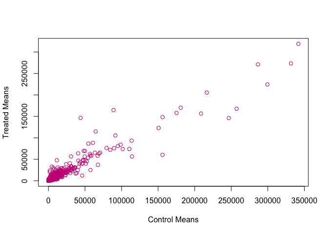
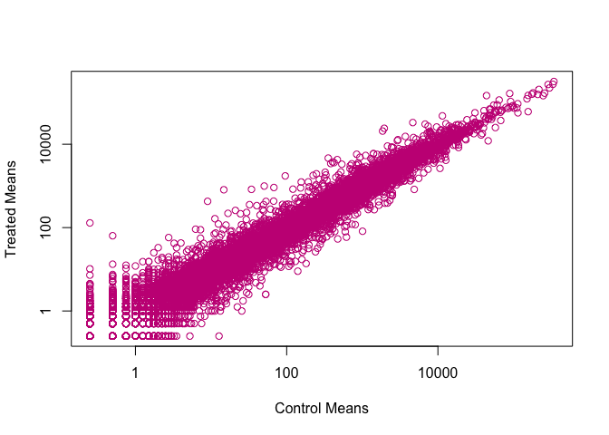
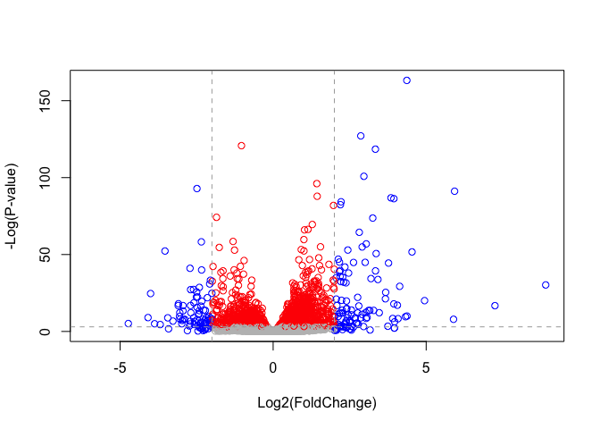
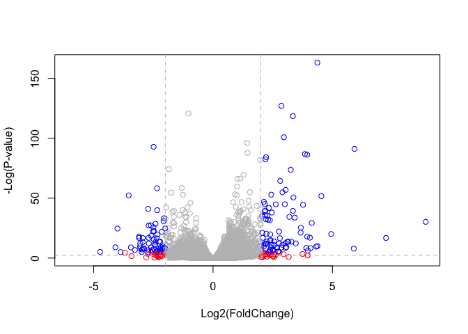
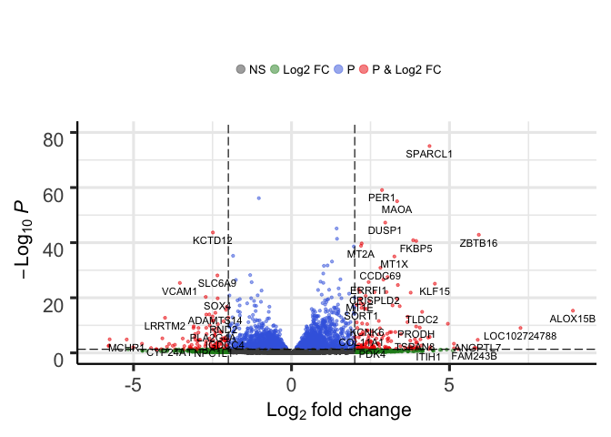

lecture\_14\_walkthrough
================
LQ
5/17/2019

``` r
counts <- read.csv("airway_scaledcounts.csv", stringsAsFactors = FALSE)
metadata <-  read.csv("airway_metadata.csv", stringsAsFactors = FALSE)
```

Q1. How many genes are we dealing with here?
--------------------------------------------

``` r
nrow(counts)
```

    ## [1] 38694

### Let's check to see is the format of the labels is correct between the colnames and the counts so that DESeq2 will work correctly and accurately

``` r
colnames(counts)
```

    ## [1] "ensgene"    "SRR1039508" "SRR1039509" "SRR1039512" "SRR1039513"
    ## [6] "SRR1039516" "SRR1039517" "SRR1039520" "SRR1039521"

``` r
metadata$id
```

    ## [1] "SRR1039508" "SRR1039509" "SRR1039512" "SRR1039513" "SRR1039516"
    ## [6] "SRR1039517" "SRR1039520" "SRR1039521"

``` r
colnames(counts[-1])
```

    ## [1] "SRR1039508" "SRR1039509" "SRR1039512" "SRR1039513" "SRR1039516"
    ## [6] "SRR1039517" "SRR1039520" "SRR1039521"

``` r
colnames(counts)[-1] == metadata$id
```

    ## [1] TRUE TRUE TRUE TRUE TRUE TRUE TRUE TRUE

``` r
all(colnames(counts)[-1] == metadata$id)
```

    ## [1] TRUE

``` r
control <- metadata[metadata[,"dex"]=="control",]
control.mean <- rowSums( counts[ ,control$id] )/4 
names(control.mean) <- counts$ensgene
```

### ONE AT A TIME

``` r
control <- metadata[metadata[,"dex"]=="control",]
control
```

    ##           id     dex celltype     geo_id
    ## 1 SRR1039508 control   N61311 GSM1275862
    ## 3 SRR1039512 control  N052611 GSM1275866
    ## 5 SRR1039516 control  N080611 GSM1275870
    ## 7 SRR1039520 control  N061011 GSM1275874

### Now we want to get the cols in counts with these 'control$id' colnames

Changing the last "4" to make the code more robust

``` r
control.mean <- rowSums( counts[ ,control$id] )/length(control$id)
head(control.mean)
```

    ## [1] 900.75   0.00 520.50 339.75  97.25   0.75

### Keeping things organized so assigning the names of the genes to the means

``` r
names(control.mean) <- counts$ensgene

head(control.mean)
```

    ## ENSG00000000003 ENSG00000000005 ENSG00000000419 ENSG00000000457 
    ##          900.75            0.00          520.50          339.75 
    ## ENSG00000000460 ENSG00000000938 
    ##           97.25            0.75

### Now do the same for the 'treated' samples

``` r
treated <- metadata[metadata[,"dex"]=="treated",]
treated.mean <- rowSums( counts[ ,treated$id] )/length(treated$id)
names(treated.mean) <- counts$ensgene
#names(treated.mean)
head(treated.mean)
```

    ## ENSG00000000003 ENSG00000000005 ENSG00000000419 ENSG00000000457 
    ##          658.00            0.00          546.00          316.50 
    ## ENSG00000000460 ENSG00000000938 
    ##           78.75            0.00

Let's put these together into a new data.frame called 'meancounts'
==================================================================

``` r
meancounts <- data.frame(control.mean, treated.mean)
head(meancounts)
```

    ##                 control.mean treated.mean
    ## ENSG00000000003       900.75       658.00
    ## ENSG00000000005         0.00         0.00
    ## ENSG00000000419       520.50       546.00
    ## ENSG00000000457       339.75       316.50
    ## ENSG00000000460        97.25        78.75
    ## ENSG00000000938         0.75         0.00

Plot treated vs control (y by x)
--------------------------------

``` r
plot(meancounts, xlab = "Control Means", ylab = "Treated Means", col = "mediumvioletred")
```



Q6. Try plotting both axes on a log scale. What is the argument to plot() that allows you to do this?
-----------------------------------------------------------------------------------------------------

``` r
plot(meancounts, xlab = "Control Means", ylab = "Treated Means", col = "mediumvioletred", log = "xy")
```

    ## Warning in xy.coords(x, y, xlabel, ylabel, log): 15032 x values <= 0
    ## omitted from logarithmic plot

    ## Warning in xy.coords(x, y, xlabel, ylabel, log): 15281 y values <= 0
    ## omitted from logarithmic plot



``` r
meancounts$log2fc <- log2(meancounts[,"treated.mean"]/meancounts[,"control.mean"])
head(meancounts)
```

    ##                 control.mean treated.mean      log2fc
    ## ENSG00000000003       900.75       658.00 -0.45303916
    ## ENSG00000000005         0.00         0.00         NaN
    ## ENSG00000000419       520.50       546.00  0.06900279
    ## ENSG00000000457       339.75       316.50 -0.10226805
    ## ENSG00000000460        97.25        78.75 -0.30441833
    ## ENSG00000000938         0.75         0.00        -Inf

### The NaN is returned when you divide by zero and try to take the log. The -Inf is returned when you try to take the log of zero. It turns out that there are a lot of genes with zero expression. Let’s filter our data to remove these genes. Again inspect your result (and the intermediate steps) to see if things make sense to you

``` r
##Identify the rows (i.e. genes) with zero values
zero.vals <- which(meancounts[,1:2]==0, arr.ind=TRUE)
to.rm <- unique(zero.vals[,1])

##can make the above two lines into one unique(which(meancounts[,1:2]==0, arr.ind = TRUE)[,1])

##Remove these rows as we can't really say much about them
mycounts <- meancounts[-to.rm,]
head(mycounts)
```

    ##                 control.mean treated.mean      log2fc
    ## ENSG00000000003       900.75       658.00 -0.45303916
    ## ENSG00000000419       520.50       546.00  0.06900279
    ## ENSG00000000457       339.75       316.50 -0.10226805
    ## ENSG00000000460        97.25        78.75 -0.30441833
    ## ENSG00000000971      5219.00      6687.50  0.35769358
    ## ENSG00000001036      2327.00      1785.75 -0.38194109

A common threshold used for calling something differentially expressed is a log2(FoldChange) of greater than 2 or less than -2. Let’s filter the dataset both ways to see how many genes are up or down-regulated.
------------------------------------------------------------------------------------------------------------------------------------------------------------------------------------------------------------------

``` r
up.ind <- mycounts$log2fc > 2
down.ind <- mycounts$log2fc < (-2)
length (which(up.ind == TRUE))
```

    ## [1] 250

``` r
length (which(down.ind == TRUE))
```

    ## [1] 367

``` r
##could also use sum because True = 1 and False = 0; sum(up.ind)
```

Section 4, Reading annotation data
----------------------------------

``` r
anno <- read.csv("annotables_grch38.csv")
head(anno)
```

    ##           ensgene entrez   symbol chr     start       end strand
    ## 1 ENSG00000000003   7105   TSPAN6   X 100627109 100639991     -1
    ## 2 ENSG00000000005  64102     TNMD   X 100584802 100599885      1
    ## 3 ENSG00000000419   8813     DPM1  20  50934867  50958555     -1
    ## 4 ENSG00000000457  57147    SCYL3   1 169849631 169894267     -1
    ## 5 ENSG00000000460  55732 C1orf112   1 169662007 169854080      1
    ## 6 ENSG00000000938   2268      FGR   1  27612064  27635277     -1
    ##          biotype
    ## 1 protein_coding
    ## 2 protein_coding
    ## 3 protein_coding
    ## 4 protein_coding
    ## 5 protein_coding
    ## 6 protein_coding
    ##                                                                                                  description
    ## 1                                                          tetraspanin 6 [Source:HGNC Symbol;Acc:HGNC:11858]
    ## 2                                                            tenomodulin [Source:HGNC Symbol;Acc:HGNC:17757]
    ## 3 dolichyl-phosphate mannosyltransferase polypeptide 1, catalytic subunit [Source:HGNC Symbol;Acc:HGNC:3005]
    ## 4                                               SCY1-like, kinase-like 3 [Source:HGNC Symbol;Acc:HGNC:19285]
    ## 5                                    chromosome 1 open reading frame 112 [Source:HGNC Symbol;Acc:HGNC:25565]
    ## 6                          FGR proto-oncogene, Src family tyrosine kinase [Source:HGNC Symbol;Acc:HGNC:3697]

### We will use the **merge()** function to add annotation data to our 'mycounts' results

``` r
mycounts.anno <- merge(x = mycounts, y = anno, by.x = "row.names", by.y = "ensgene")
head(mycounts.anno)
```

    ##         Row.names control.mean treated.mean      log2fc entrez   symbol
    ## 1 ENSG00000000003       900.75       658.00 -0.45303916   7105   TSPAN6
    ## 2 ENSG00000000419       520.50       546.00  0.06900279   8813     DPM1
    ## 3 ENSG00000000457       339.75       316.50 -0.10226805  57147    SCYL3
    ## 4 ENSG00000000460        97.25        78.75 -0.30441833  55732 C1orf112
    ## 5 ENSG00000000971      5219.00      6687.50  0.35769358   3075      CFH
    ## 6 ENSG00000001036      2327.00      1785.75 -0.38194109   2519    FUCA2
    ##   chr     start       end strand        biotype
    ## 1   X 100627109 100639991     -1 protein_coding
    ## 2  20  50934867  50958555     -1 protein_coding
    ## 3   1 169849631 169894267     -1 protein_coding
    ## 4   1 169662007 169854080      1 protein_coding
    ## 5   1 196651878 196747504      1 protein_coding
    ## 6   6 143494811 143511690     -1 protein_coding
    ##                                                                                                  description
    ## 1                                                          tetraspanin 6 [Source:HGNC Symbol;Acc:HGNC:11858]
    ## 2 dolichyl-phosphate mannosyltransferase polypeptide 1, catalytic subunit [Source:HGNC Symbol;Acc:HGNC:3005]
    ## 3                                               SCY1-like, kinase-like 3 [Source:HGNC Symbol;Acc:HGNC:19285]
    ## 4                                    chromosome 1 open reading frame 112 [Source:HGNC Symbol;Acc:HGNC:25565]
    ## 5                                                     complement factor H [Source:HGNC Symbol;Acc:HGNC:4883]
    ## 6                                          fucosidase, alpha-L- 2, plasma [Source:HGNC Symbol;Acc:HGNC:4008]

### **BiocManager::install("org.Hs.eg.db") \#\#\# **library("AnnotationDbi")

### \*\*library("org.Hs.eg.db")

``` r
library("AnnotationDbi")
```

    ## Loading required package: stats4

    ## Loading required package: BiocGenerics

    ## Loading required package: parallel

    ## 
    ## Attaching package: 'BiocGenerics'

    ## The following objects are masked from 'package:parallel':
    ## 
    ##     clusterApply, clusterApplyLB, clusterCall, clusterEvalQ,
    ##     clusterExport, clusterMap, parApply, parCapply, parLapply,
    ##     parLapplyLB, parRapply, parSapply, parSapplyLB

    ## The following objects are masked from 'package:stats':
    ## 
    ##     IQR, mad, sd, var, xtabs

    ## The following objects are masked from 'package:base':
    ## 
    ##     anyDuplicated, append, as.data.frame, basename, cbind,
    ##     colMeans, colnames, colSums, dirname, do.call, duplicated,
    ##     eval, evalq, Filter, Find, get, grep, grepl, intersect,
    ##     is.unsorted, lapply, lengths, Map, mapply, match, mget, order,
    ##     paste, pmax, pmax.int, pmin, pmin.int, Position, rank, rbind,
    ##     Reduce, rowMeans, rownames, rowSums, sapply, setdiff, sort,
    ##     table, tapply, union, unique, unsplit, which, which.max,
    ##     which.min

    ## Loading required package: Biobase

    ## Welcome to Bioconductor
    ## 
    ##     Vignettes contain introductory material; view with
    ##     'browseVignettes()'. To cite Bioconductor, see
    ##     'citation("Biobase")', and for packages 'citation("pkgname")'.

    ## Loading required package: IRanges

    ## Loading required package: S4Vectors

    ## 
    ## Attaching package: 'S4Vectors'

    ## The following object is masked from 'package:base':
    ## 
    ##     expand.grid

``` r
library("org.Hs.eg.db")
```

    ## 

``` r
columns(org.Hs.eg.db)
```

    ##  [1] "ACCNUM"       "ALIAS"        "ENSEMBL"      "ENSEMBLPROT" 
    ##  [5] "ENSEMBLTRANS" "ENTREZID"     "ENZYME"       "EVIDENCE"    
    ##  [9] "EVIDENCEALL"  "GENENAME"     "GO"           "GOALL"       
    ## [13] "IPI"          "MAP"          "OMIM"         "ONTOLOGY"    
    ## [17] "ONTOLOGYALL"  "PATH"         "PFAM"         "PMID"        
    ## [21] "PROSITE"      "REFSEQ"       "SYMBOL"       "UCSCKG"      
    ## [25] "UNIGENE"      "UNIPROT"

Q11. Run the mapIds() function two more times to add the Entrez ID and UniProt accession as new columns called mycounts*e**n**t**r**e**z**a**n**d**m**y**c**o**u**n**t**s*uniprot.
----------------------------------------------------------------------------------------------------------------------------------------------------------------------------------

``` r
mycounts$symbol <- mapIds(org.Hs.eg.db,
                     keys=row.names(mycounts), # Our genenames
                     keytype="ENSEMBL",        # The format of our genenames
                     column="SYMBOL",          # The new format we want to add
                     multiVals="first")
```

    ## 'select()' returned 1:many mapping between keys and columns

``` r
mycounts$entrez <- mapIds(org.Hs.eg.db,
                     keys=row.names(mycounts), # Our genenames
                     keytype="ENSEMBL",        # The format of our genenames
                     column="ENTREZID",          # The new format we want to add
                     multiVals="first")
```

    ## 'select()' returned 1:many mapping between keys and columns

``` r
mycounts$uniprot <- mapIds(org.Hs.eg.db,
                     keys=row.names(mycounts), # Our genenames
                     keytype="ENSEMBL",        # The format of our genenames
                     column="UNIPROT",          # The new format we want to add
                     multiVals="first")
```

    ## 'select()' returned 1:many mapping between keys and columns

``` r
head(mycounts)
```

    ##                 control.mean treated.mean      log2fc   symbol entrez
    ## ENSG00000000003       900.75       658.00 -0.45303916   TSPAN6   7105
    ## ENSG00000000419       520.50       546.00  0.06900279     DPM1   8813
    ## ENSG00000000457       339.75       316.50 -0.10226805    SCYL3  57147
    ## ENSG00000000460        97.25        78.75 -0.30441833 C1orf112  55732
    ## ENSG00000000971      5219.00      6687.50  0.35769358      CFH   3075
    ## ENSG00000001036      2327.00      1785.75 -0.38194109    FUCA2   2519
    ##                    uniprot
    ## ENSG00000000003 A0A024RCI0
    ## ENSG00000000419     O60762
    ## ENSG00000000457     Q8IZE3
    ## ENSG00000000460 A0A024R922
    ## ENSG00000000971 A0A024R962
    ## ENSG00000001036     Q9BTY2

Q12. Examine your annotated results for those genes with a log2(FoldChange) of greater than 2 (or less than -2 if you prefer) with the View( mycounts\[up.ind,\] ) function. What do you notice? Would you trust these results? Why or why not?
-----------------------------------------------------------------------------------------------------------------------------------------------------------------------------------------------------------------------------------------------

``` r
##View(mycounts[up.ind,])
```

5. DESeq2 analysis
------------------

Let's do this the right way. DESeq2 is an R package for analyzing count-based NGS data like RNA-seq. It is available from Bioconductor.

``` r
library(DESeq2)
```

    ## Loading required package: GenomicRanges

    ## Loading required package: GenomeInfoDb

    ## Loading required package: SummarizedExperiment

    ## Loading required package: DelayedArray

    ## Loading required package: matrixStats

    ## 
    ## Attaching package: 'matrixStats'

    ## The following objects are masked from 'package:Biobase':
    ## 
    ##     anyMissing, rowMedians

    ## Loading required package: BiocParallel

    ## 
    ## Attaching package: 'DelayedArray'

    ## The following objects are masked from 'package:matrixStats':
    ## 
    ##     colMaxs, colMins, colRanges, rowMaxs, rowMins, rowRanges

    ## The following objects are masked from 'package:base':
    ## 
    ##     aperm, apply

``` r
citation("DESeq2")
```

    ## 
    ##   Love, M.I., Huber, W., Anders, S. Moderated estimation of fold
    ##   change and dispersion for RNA-seq data with DESeq2 Genome
    ##   Biology 15(12):550 (2014)
    ## 
    ## A BibTeX entry for LaTeX users is
    ## 
    ##   @Article{,
    ##     title = {Moderated estimation of fold change and dispersion for RNA-seq data with DESeq2},
    ##     author = {Michael I. Love and Wolfgang Huber and Simon Anders},
    ##     year = {2014},
    ##     journal = {Genome Biology},
    ##     doi = {10.1186/s13059-014-0550-8},
    ##     volume = {15},
    ##     issue = {12},
    ##     pages = {550},
    ##   }

Build our DEseq dataset object
------------------------------

``` r
dds <- DESeqDataSetFromMatrix(countData=counts, 
                              colData=metadata, 
                              design=~dex, 
                              tidy=TRUE)
```

    ## converting counts to integer mode

    ## Warning in DESeqDataSet(se, design = design, ignoreRank): some variables in
    ## design formula are characters, converting to factors

``` r
dds
```

    ## class: DESeqDataSet 
    ## dim: 38694 8 
    ## metadata(1): version
    ## assays(1): counts
    ## rownames(38694): ENSG00000000003 ENSG00000000005 ...
    ##   ENSG00000283120 ENSG00000283123
    ## rowData names(0):
    ## colnames(8): SRR1039508 SRR1039509 ... SRR1039520 SRR1039521
    ## colData names(4): id dex celltype geo_id

``` r
dds <- DESeq(dds)
```

    ## estimating size factors

    ## estimating dispersions

    ## gene-wise dispersion estimates

    ## mean-dispersion relationship

    ## final dispersion estimates

    ## fitting model and testing

``` r
res <- results(dds)
#as.data.frame(res)
```

``` r
summary(res)
```

    ## 
    ## out of 25258 with nonzero total read count
    ## adjusted p-value < 0.1
    ## LFC > 0 (up)       : 1563, 6.2%
    ## LFC < 0 (down)     : 1188, 4.7%
    ## outliers [1]       : 142, 0.56%
    ## low counts [2]     : 9971, 39%
    ## (mean count < 10)
    ## [1] see 'cooksCutoff' argument of ?results
    ## [2] see 'independentFiltering' argument of ?results

### Changing p-value to 0.05

``` r
res05 <- results(dds, alpha=0.05)
summary(res05)
```

    ## 
    ## out of 25258 with nonzero total read count
    ## adjusted p-value < 0.05
    ## LFC > 0 (up)       : 1236, 4.9%
    ## LFC < 0 (down)     : 933, 3.7%
    ## outliers [1]       : 142, 0.56%
    ## low counts [2]     : 9033, 36%
    ## (mean count < 6)
    ## [1] see 'cooksCutoff' argument of ?results
    ## [2] see 'independentFiltering' argument of ?results

Let's make a commonly produced visualization from this data, namely a so-called Volcano plot. These summary figures are frequently used to highlight the proportion of genes that are both significantly regulated and display a high fold change.
--------------------------------------------------------------------------------------------------------------------------------------------------------------------------------------------------------------------------------------------------

Typically these plots shows the log fold change on the X-axis, and the −log10 of the p-value on the Y-axis (the more significant the p-value, the larger the −log10 of that value will be). A very dull (i.e. non colored and labeled) version can be created with a quick call to plot() like so:
--------------------------------------------------------------------------------------------------------------------------------------------------------------------------------------------------------------------------------------------------------------------------------------------------

Without the minus for the y-axis, the volcano plot would be upsidedown so for convention the minus is put in to flip the graph

``` r
mycols <- rep("gray", nrow(res))
mycols[res$padj<0.05] <- "red"

mycols[abs(res$log2FoldChange)>2] <- "blue"

plot( res$log2FoldChange,  -log(res$padj), 
      xlab="Log2(FoldChange)",
      ylab="-Log(P-value)", col=mycols)
abline(h=-log(0.05), col = "darkgray", lty=2)
abline(v=c(-2,2), col = "darkgray", lty=2)
```



Another way to plot this is with the Enhanced, but first let's put proper gene names on our results(i.e. gene'symbols')
-----------------------------------------------------------------------------------------------------------------------

``` r
x <- as.data.frame(res)
x$symbol <- mapIds(org.Hs.eg.db, 
                   keys=row.names(x),
                   keytype="ENSEMBL",
                   column="SYMBOL",
                   multiVals="first")
```

    ## 'select()' returned 1:many mapping between keys and columns

``` r
head(x)
```

    ##                    baseMean log2FoldChange     lfcSE       stat     pvalue
    ## ENSG00000000003 747.1941954    -0.35070302 0.1682457 -2.0844697 0.03711747
    ## ENSG00000000005   0.0000000             NA        NA         NA         NA
    ## ENSG00000000419 520.1341601     0.20610777 0.1010592  2.0394752 0.04140263
    ## ENSG00000000457 322.6648439     0.02452695 0.1451451  0.1689823 0.86581056
    ## ENSG00000000460  87.6826252    -0.14714205 0.2570073 -0.5725210 0.56696907
    ## ENSG00000000938   0.3191666    -1.73228897 3.4936010 -0.4958463 0.62000288
    ##                      padj   symbol
    ## ENSG00000000003 0.1630348   TSPAN6
    ## ENSG00000000005        NA     TNMD
    ## ENSG00000000419 0.1760317     DPM1
    ## ENSG00000000457 0.9616942    SCYL3
    ## ENSG00000000460 0.8158486 C1orf112
    ## ENSG00000000938        NA      FGR

``` r
##STRAIGHT FROM WORKBOOK

# Setup our custom point color vector 
mycols <- rep("gray", nrow(res))
mycols[ abs(res$log2FoldChange) > 2 ]  <- "red" 

inds <- (res$padj < 0.01) & (abs(res$log2FoldChange) > 2 )
mycols[ inds ] <- "blue"

# Volcano plot with custom colors 
plot( res$log2FoldChange,  -log(res$padj), 
 col=mycols, ylab="-Log(P-value)", xlab="Log2(FoldChange)" )

# Cut-off lines
abline(v=c(-2,2), col="gray", lty=2)
abline(h=-log(0.1), col="gray", lty=2)
```



### BiocManager::install("EnhancedVolcano")

``` r
library(EnhancedVolcano)
```

    ## Loading required package: ggplot2

    ## Loading required package: ggrepel

``` r
EnhancedVolcano(x,
    lab = x$symbol,
    x = 'log2FoldChange',
    y = 'pvalue')
```

    ## Warning: Removed 13578 rows containing missing values (geom_point).

    ## Warning: Removed 24 rows containing missing values (geom_text).


