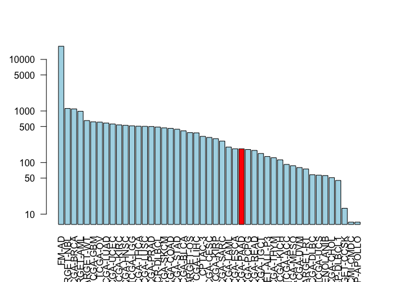

Lecture\_18\_walkthrough
================
LQ
5/31/2019

#### source("<https://bioconductor.org/biocLite.R>")

#### biocLite(c("GenomicDataCommons", "TCGAbiolinks", "maftools"))

``` r
library(GenomicDataCommons)
```

    ## Loading required package: magrittr

    ## 
    ## Attaching package: 'GenomicDataCommons'

    ## The following object is masked from 'package:stats':
    ## 
    ##     filter

``` r
library(TCGAbiolinks)
##Install error occurred saying that there is no package called ʻcmprskʻ - it is most likely a "dependency" package that the main package you are trying to use needs to run
##Determined that cmprsk is newly updated and will only work in the most current version of r
##Google it and see if there are other versions to download
library(maftools)
```

``` r
status()
```

    ## $commit
    ## [1] "3e22a4257d5079ae9f7193950b51ed9dfc561ed1"
    ## 
    ## $data_release
    ## [1] "Data Release 17.0 - June 05, 2019"
    ## 
    ## $status
    ## [1] "OK"
    ## 
    ## $tag
    ## [1] "1.21.0"
    ## 
    ## $version
    ## [1] 1

``` r
projects <- getGDCprojects()
head(projects)
```

    ##   dbgap_accession_number
    ## 1              phs001287
    ## 2              phs001374
    ## 3              phs001628
    ## 4              phs000466
    ## 5              phs000467
    ## 6              phs001179
    ##                                                                                                                                                                                                                                                                                                                                                                                                                                                                                                                                                                                                                                 disease_type
    ## 1                                                                                                                                                                                                                                                                                                                                                                                                                                                                                                                                                                                                               Adenomas and Adenocarcinomas
    ## 2                                                                                                                                                                                                                                                                                                                                                                                                                                                                                                                                                                                         Epithelial Neoplasms, NOS, Squamous Cell Neoplasms
    ## 3                                                                                                                                                                                                                                                                                                                                                                                                                                                                                                                                                                                                                          Myeloid Leukemias
    ## 4                                                                                                                                                                                                                                                                                                                                                                                                                                                                                                                                                                                                           Clear Cell Sarcoma of the Kidney
    ## 5                                                                                                                                                                                                                                                                                                                                                                                                                                                                                                                                                                                                                              Neuroblastoma
    ## 6 Germ Cell Neoplasms, Acinar Cell Neoplasms, Miscellaneous Tumors, Thymic Epithelial Neoplasms, Gliomas, Basal Cell Neoplasms, Neuroepitheliomatous Neoplasms, Ductal and Lobular Neoplasms, Complex Mixed and Stromal Neoplasms, Complex Epithelial Neoplasms, Adnexal and Skin Appendage Neoplasms, Mesothelial Neoplasms, Mucoepidermoid Neoplasms, Not Reported, Specialized Gonadal Neoplasms, Cystic, Mucinous and Serous Neoplasms, Adenomas and Adenocarcinomas, Epithelial Neoplasms, NOS, Squamous Cell Neoplasms, Transitional Cell Papillomas and Carcinomas, Paragangliomas and Glomus Tumors, Nevi and Melanomas, Meningiomas
    ##   releasable released state
    ## 1      FALSE     TRUE  open
    ## 2      FALSE     TRUE  open
    ## 3      FALSE     TRUE  open
    ## 4       TRUE     TRUE  open
    ## 5       TRUE     TRUE  open
    ## 6      FALSE     TRUE  open
    ##                                                                                                                                                                                                                                                                                                                                                                                                                                                                                                                                                                                                                                                                                                                                                                                                                                                               primary_site
    ## 1                                                                                                                                                                                                                                                                                                                                                                                                                                                                                                                                                                                                                                                                                                                                                                                                                                   Kidney, Bronchus and lung, Uterus, NOS
    ## 2                                                                                                                                                                                                                                                                                                                                                                                                                                                                                                                                                                                                                                                                                                                                                                                                                                                        Bronchus and lung
    ## 3                                                                                                                                                                                                                                                                                                                                                                                                                                                                                                                                                                                                                                                                                                                                                                                                                            Hematopoietic and reticuloendothelial systems
    ## 4                                                                                                                                                                                                                                                                                                                                                                                                                                                                                                                                                                                                                                                                                                                                                                                                                                                                   Kidney
    ## 5                                                                                                                                                                                                                                                                                                                                                                                                                                                                                                                                                                                                                                                                                                                                                                                                                                                           Nervous System
    ## 6 Testis, Gallbladder, Unknown, Other and unspecified parts of biliary tract, Adrenal gland, Thyroid gland, Spinal cord, cranial nerves, and other parts of central nervous system, Peripheral nerves and autonomic nervous system, Stomach, Cervix uteri, Bladder, Small intestine, Breast, Prostate gland, Other and unspecified female genital organs, Other and unspecified major salivary glands, Rectum, Retroperitoneum and peritoneum, Pancreas, Heart, mediastinum, and pleura, Bronchus and lung, Liver and intrahepatic bile ducts, Other and ill-defined sites, Thymus, Penis, Nasopharynx, Ovary, Uterus, NOS, Vulva, Anus and anal canal, Other and unspecified urinary organs, Trachea, Ureter, Other endocrine glands and related structures, Not Reported, Colon, Kidney, Vagina, Skin, Esophagus, Eye and adnexa, Other and ill-defined digestive organs
    ##              project_id                    id
    ## 1               CPTAC-3               CPTAC-3
    ## 2        VAREPOP-APOLLO        VAREPOP-APOLLO
    ## 3 BEATAML1.0-CRENOLANIB BEATAML1.0-CRENOLANIB
    ## 4           TARGET-CCSK           TARGET-CCSK
    ## 5            TARGET-NBL            TARGET-NBL
    ## 6                 FM-AD                 FM-AD
    ##                                                                                              name
    ## 1                                                                                                
    ## 2                                                          VA Research Precision Oncology Program
    ## 3 Clinical Resistance to Crenolanib in Acute Myeloid Leukemia Due to Diverse Molecular Mechanisms
    ## 4                                                                Clear Cell Sarcoma of the Kidney
    ## 5                                                                                   Neuroblastoma
    ## 6                                       Foundation Medicine Adult Cancer Clinical Dataset (FM-AD)
    ##        tumor
    ## 1          3
    ## 2     APOLLO
    ## 3 CRENOLANIB
    ## 4       CCSK
    ## 5        NBL
    ## 6         AD

``` r
cases_by_project <- cases() %>%
  facet("project.project_id") %>%
  aggregations()
head(cases_by_project)
```

    ## $project.project_id
    ##                      key doc_count
    ## 1                  FM-AD     18004
    ## 2             TARGET-NBL      1120
    ## 3              TCGA-BRCA      1098
    ## 4             TARGET-AML       988
    ## 5              TARGET-WT       652
    ## 6               TCGA-GBM       617
    ## 7                TCGA-OV       608
    ## 8              TCGA-LUAD       585
    ## 9              TCGA-UCEC       560
    ## 10             TCGA-KIRC       537
    ## 11             TCGA-HNSC       528
    ## 12              TCGA-LGG       516
    ## 13             TCGA-THCA       507
    ## 14             TCGA-LUSC       504
    ## 15             TCGA-PRAD       500
    ## 16          NCICCR-DLBCL       489
    ## 17             TCGA-SKCM       470
    ## 18             TCGA-COAD       461
    ## 19             TCGA-STAD       443
    ## 20             TCGA-BLCA       412
    ## 21             TARGET-OS       381
    ## 22             TCGA-LIHC       377
    ## 23               CPTAC-3       322
    ## 24             TCGA-CESC       307
    ## 25             TCGA-KIRP       291
    ## 26             TCGA-SARC       261
    ## 27             TCGA-LAML       200
    ## 28             TCGA-ESCA       185
    ## 29             TCGA-PAAD       185
    ## 30             TCGA-PCPG       179
    ## 31             TCGA-READ       172
    ## 32             TCGA-TGCT       150
    ## 33         TARGET-ALL-P3       131
    ## 34             TCGA-THYM       124
    ## 35             TCGA-KICH       113
    ## 36              TCGA-ACC        92
    ## 37             TCGA-MESO        87
    ## 38              TCGA-UVM        80
    ## 39             TARGET-RT        75
    ## 40             TCGA-DLBC        58
    ## 41              TCGA-UCS        57
    ## 42 BEATAML1.0-CRENOLANIB        56
    ## 43             TCGA-CHOL        51
    ## 44           CTSP-DLBCL1        45
    ## 45           TARGET-CCSK        13
    ## 46             HCMI-CMDC         7
    ## 47        VAREPOP-APOLLO         7

``` r
x <- cases_by_project$project.project_id

x$key == "TCGA-PAAD"
```

    ##  [1] FALSE FALSE FALSE FALSE FALSE FALSE FALSE FALSE FALSE FALSE FALSE
    ## [12] FALSE FALSE FALSE FALSE FALSE FALSE FALSE FALSE FALSE FALSE FALSE
    ## [23] FALSE FALSE FALSE FALSE FALSE FALSE  TRUE FALSE FALSE FALSE FALSE
    ## [34] FALSE FALSE FALSE FALSE FALSE FALSE FALSE FALSE FALSE FALSE FALSE
    ## [45] FALSE FALSE FALSE

``` r
# Make a custom color vector for our plot
colvec <- rep("lightblue", nrow(x))
colvec[x$key == "TCGA-PAAD"] <- "red"


# Plot with 'log' for y axis and rotate labels with 'las'
#par(___)  
barplot(x$doc_count, names.arg=x$key, log="y", col=colvec, las=2)
```



``` r
samp <- getSampleFilesSummary("TCGA-PAAD")
```

    ## Accessing information for project: TCGA-PAAD

    ## Using 'state_comment' as value column. Use 'value.var' to override

    ## Aggregation function missing: defaulting to length

``` r
## Accessing information for project: TCGA-PAAD
## Using 'state_comment' as value column. Use 'value.var' to override
## Aggregation function missing: defaulting to length
head(samp)
```

    ##            .id Biospecimen_Biospecimen Supplement
    ## 1 TCGA-2J-AAB1                                 14
    ## 2 TCGA-2J-AAB4                                 14
    ## 3 TCGA-2J-AAB6                                 14
    ## 4 TCGA-2J-AAB8                                 14
    ## 5 TCGA-2J-AAB9                                 14
    ## 6 TCGA-2J-AABA                                 14
    ##   Biospecimen_Slide Image_Diagnostic Slide
    ## 1                                        1
    ## 2                                        1
    ## 3                                        1
    ## 4                                        1
    ## 5                                        1
    ## 6                                        1
    ##   Biospecimen_Slide Image_Tissue Slide Clinical_Clinical Supplement
    ## 1                                    1                            8
    ## 2                                    1                            8
    ## 3                                    1                            8
    ## 4                                    1                            8
    ## 5                                    1                            8
    ## 6                                    1                            8
    ##   Copy Number Variation_Copy Number Segment_Genotyping Array_Affymetrix SNP 6.0
    ## 1                                                                             2
    ## 2                                                                             2
    ## 3                                                                             2
    ## 4                                                                             2
    ## 5                                                                             2
    ## 6                                                                             2
    ##   Copy Number Variation_Gene Level Copy Number Scores_Genotyping Array_Affymetrix SNP 6.0
    ## 1                                                                                       1
    ## 2                                                                                       1
    ## 3                                                                                       1
    ## 4                                                                                       1
    ## 5                                                                                       1
    ## 6                                                                                       1
    ##   Copy Number Variation_Masked Copy Number Segment_Genotyping Array_Affymetrix SNP 6.0
    ## 1                                                                                    2
    ## 2                                                                                    2
    ## 3                                                                                    2
    ## 4                                                                                    2
    ## 5                                                                                    2
    ## 6                                                                                    2
    ##   DNA Methylation_Methylation Beta Value_Methylation Array_Illumina Human Methylation 450
    ## 1                                                                                       1
    ## 2                                                                                       1
    ## 3                                                                                       1
    ## 4                                                                                       1
    ## 5                                                                                       1
    ## 6                                                                                       1
    ##   Sequencing Reads_Aligned Reads_miRNA-Seq_Illumina
    ## 1                                                 1
    ## 2                                                 1
    ## 3                                                 1
    ## 4                                                 1
    ## 5                                                 1
    ## 6                                                 1
    ##   Sequencing Reads_Aligned Reads_RNA-Seq_Illumina
    ## 1                                               1
    ## 2                                               1
    ## 3                                               1
    ## 4                                               1
    ## 5                                               1
    ## 6                                               1
    ##   Sequencing Reads_Aligned Reads_WXS_Illumina
    ## 1                                           2
    ## 2                                           2
    ## 3                                           2
    ## 4                                           2
    ## 5                                           2
    ## 6                                           2
    ##   Simple Nucleotide Variation_Aggregated Somatic Mutation_WXS
    ## 1                                                           4
    ## 2                                                           4
    ## 3                                                           4
    ## 4                                                           4
    ## 5                                                           4
    ## 6                                                           4
    ##   Simple Nucleotide Variation_Annotated Somatic Mutation_WXS
    ## 1                                                          4
    ## 2                                                          4
    ## 3                                                          4
    ## 4                                                          4
    ## 5                                                          4
    ## 6                                                          4
    ##   Simple Nucleotide Variation_Masked Somatic Mutation_WXS
    ## 1                                                       4
    ## 2                                                       4
    ## 3                                                       4
    ## 4                                                       4
    ## 5                                                       4
    ## 6                                                       4
    ##   Simple Nucleotide Variation_Raw Simple Somatic Mutation_WXS
    ## 1                                                           4
    ## 2                                                           4
    ## 3                                                           4
    ## 4                                                           4
    ## 5                                                           4
    ## 6                                                           4
    ##   Transcriptome Profiling_Gene Expression Quantification_RNA-Seq
    ## 1                                                              3
    ## 2                                                              3
    ## 3                                                              3
    ## 4                                                              3
    ## 5                                                              3
    ## 6                                                              3
    ##   Transcriptome Profiling_Isoform Expression Quantification_miRNA-Seq
    ## 1                                                                   1
    ## 2                                                                   1
    ## 3                                                                   1
    ## 4                                                                   1
    ## 5                                                                   1
    ## 6                                                                   1
    ##   Transcriptome Profiling_miRNA Expression Quantification_miRNA-Seq
    ## 1                                                                 1
    ## 2                                                                 1
    ## 3                                                                 1
    ## 4                                                                 1
    ## 5                                                                 1
    ## 6                                                                 1
    ##     project
    ## 1 TCGA-PAAD
    ## 2 TCGA-PAAD
    ## 3 TCGA-PAAD
    ## 4 TCGA-PAAD
    ## 5 TCGA-PAAD
    ## 6 TCGA-PAAD

``` r
#GDCquery() function to focus in on a particular data type that we are interested in

query <- GDCquery(project="TCGA-PAAD",
                  data.category="Transcriptome Profiling",
                  data.type="Gene Expression Quantification")
```

    ## --------------------------------------

    ## o GDCquery: Searching in GDC database

    ## --------------------------------------

    ## Genome of reference: hg38

    ## --------------------------------------------

    ## oo Accessing GDC. This might take a while...

    ## --------------------------------------------

    ## ooo Project: TCGA-PAAD

    ## --------------------

    ## oo Filtering results

    ## --------------------

    ## ooo By data.type

    ## ----------------

    ## oo Checking data

    ## ----------------

    ## ooo Check if there are duplicated cases

    ## Warning: There are more than one file for the same case. Please verify query results. You can use the command View(getResults(query)) in rstudio

    ## ooo Check if there results for the query

    ## -------------------

    ## o Preparing output

    ## -------------------

``` r
ans <- getResults(query)
head(ans)
```

    ##   data_release                      data_type
    ## 1  12.0 - 17.0 Gene Expression Quantification
    ## 2  12.0 - 17.0 Gene Expression Quantification
    ## 3  12.0 - 17.0 Gene Expression Quantification
    ## 4  12.0 - 17.0 Gene Expression Quantification
    ## 5  12.0 - 17.0 Gene Expression Quantification
    ## 6  12.0 - 17.0 Gene Expression Quantification
    ##                   updated_datetime
    ## 1 2019-05-23T23:18:56.468363+00:00
    ## 2 2019-05-23T23:18:56.468363+00:00
    ## 3 2019-05-23T23:18:56.468363+00:00
    ## 4 2019-05-23T23:18:56.468363+00:00
    ## 5 2019-05-23T23:18:56.468363+00:00
    ## 6 2019-05-23T23:18:56.468363+00:00
    ##                                              file_name
    ## 1  4df16e07-cdbc-46cc-8b9c-39d4a9dca09e.FPKM-UQ.txt.gz
    ## 2 1f997074-0020-47e6-9928-5bf7209c552d.htseq.counts.gz
    ## 3 cc133a8a-77ad-4570-852e-df72548c6897.htseq.counts.gz
    ## 4  e7cc80ef-4b87-47d9-bebe-1fb05b5b04a2.FPKM-UQ.txt.gz
    ## 5 232f085b-6201-4e4d-8473-e592b8d8e16d.htseq.counts.gz
    ## 6     a155ec07-2baf-404b-85bc-28330a8fee33.FPKM.txt.gz
    ##                                  submitter_id
    ## 1 4df16e07-cdbc-46cc-8b9c-39d4a9dca09e_uqfpkm
    ## 2  1f997074-0020-47e6-9928-5bf7209c552d_count
    ## 3  cc133a8a-77ad-4570-852e-df72548c6897_count
    ## 4 e7cc80ef-4b87-47d9-bebe-1fb05b5b04a2_uqfpkm
    ## 5  232f085b-6201-4e4d-8473-e592b8d8e16d_count
    ## 6   a155ec07-2baf-404b-85bc-28330a8fee33_fpkm
    ##                                file_id file_size
    ## 1 4ac5c2da-497f-4fb4-80db-c7e774c1873a    526515
    ## 2 78bb8d49-54aa-43a1-aec4-31da818cdb14    250443
    ## 3 82d7d3b5-85bc-46b9-b9cd-2bdeb279dc0f    255221
    ## 4 3cbf3948-3ac4-4824-9b6f-6efcf13066b5    556107
    ## 5 13dfd8da-5d36-48fa-a82c-77b5c5e77e7b    252815
    ## 6 c6a9b770-845a-4a10-ac02-28928def043c    504140
    ##                          cases                                   id
    ## 1 TCGA-YY-A8LH-01A-11R-A36G-07 4ac5c2da-497f-4fb4-80db-c7e774c1873a
    ## 2 TCGA-H6-A45N-01A-11R-A26U-07 78bb8d49-54aa-43a1-aec4-31da818cdb14
    ## 3 TCGA-RB-AA9M-01A-11R-A39D-07 82d7d3b5-85bc-46b9-b9cd-2bdeb279dc0f
    ## 4 TCGA-HZ-8637-01A-11R-2404-07 3cbf3948-3ac4-4824-9b6f-6efcf13066b5
    ## 5 TCGA-HZ-7918-01A-11R-2156-07 13dfd8da-5d36-48fa-a82c-77b5c5e77e7b
    ## 6 TCGA-2J-AABP-01A-11R-A41B-07 c6a9b770-845a-4a10-ac02-28928def043c
    ##                   created_datetime                           md5sum
    ## 1 2016-05-30T18:58:14.322399-05:00 fece0a61ad30a786de8ee50d25028d61
    ## 2 2016-05-30T18:21:31.785829-05:00 31eaf2ddc469f44cbbcddf92e631af67
    ## 3 2016-05-30T18:32:49.244208-05:00 435a535f7904090d6b97eb2eee7ed71e
    ## 4 2016-05-29T10:21:16.740924-05:00 9d250e9709c04a2005a93948fc8e11eb
    ## 5 2016-05-29T10:37:43.483990-05:00 fb22772a5d5948778ea2f77cdecb3050
    ## 6 2016-05-30T18:36:35.355486-05:00 7dd83ad6f57154e1ce9c921f2d61d7a3
    ##   data_format access    state version           data_category
    ## 1         TXT   open released       1 Transcriptome Profiling
    ## 2         TXT   open released       1 Transcriptome Profiling
    ## 3         TXT   open released       1 Transcriptome Profiling
    ## 4         TXT   open released       1 Transcriptome Profiling
    ## 5         TXT   open released       1 Transcriptome Profiling
    ## 6         TXT   open released       1 Transcriptome Profiling
    ##              type experimental_strategy   project
    ## 1 gene_expression               RNA-Seq TCGA-PAAD
    ## 2 gene_expression               RNA-Seq TCGA-PAAD
    ## 3 gene_expression               RNA-Seq TCGA-PAAD
    ## 4 gene_expression               RNA-Seq TCGA-PAAD
    ## 5 gene_expression               RNA-Seq TCGA-PAAD
    ## 6 gene_expression               RNA-Seq TCGA-PAAD
    ##                            analysis_id        analysis_updated_datetime
    ## 1 509f861f-23f1-4201-b0ea-90cfd03ccd49 2018-09-10T15:08:41.786316-05:00
    ## 2 e196345c-9a5d-481d-abd1-67c65c271283 2018-09-10T15:08:41.786316-05:00
    ## 3 7d970bb5-b3d5-4e90-9a32-cfddb0590287 2018-09-10T15:08:41.786316-05:00
    ## 4 f6899766-4888-436e-bc07-3158e2fbf0a9 2018-09-10T15:08:41.786316-05:00
    ## 5 3283f6cf-5aff-4833-b7a8-60726c06d7f6 2018-09-10T15:08:41.786316-05:00
    ## 6 21eda9da-73c8-44c2-a666-c7ca7a570a23 2018-09-10T15:08:41.786316-05:00
    ##          analysis_created_datetime
    ## 1 2016-05-30T18:58:14.322399-05:00
    ## 2 2016-05-30T18:21:31.785829-05:00
    ## 3 2016-05-30T18:32:49.244208-05:00
    ## 4 2016-05-29T10:21:16.740924-05:00
    ## 5 2016-05-29T10:37:43.483990-05:00
    ## 6 2016-05-30T18:36:35.355486-05:00
    ##                         analysis_submitter_id analysis_state
    ## 1 4df16e07-cdbc-46cc-8b9c-39d4a9dca09e_uqfpkm       released
    ## 2  1f997074-0020-47e6-9928-5bf7209c552d_count       released
    ## 3  cc133a8a-77ad-4570-852e-df72548c6897_count       released
    ## 4 e7cc80ef-4b87-47d9-bebe-1fb05b5b04a2_uqfpkm       released
    ## 5  232f085b-6201-4e4d-8473-e592b8d8e16d_count       released
    ## 6   a155ec07-2baf-404b-85bc-28330a8fee33_fpkm       released
    ##                 analysis_workflow_link analysis_workflow_type
    ## 1 https://github.com/NCI-GDC/htseq-cwl        HTSeq - FPKM-UQ
    ## 2 https://github.com/NCI-GDC/htseq-cwl         HTSeq - Counts
    ## 3 https://github.com/NCI-GDC/htseq-cwl         HTSeq - Counts
    ## 4 https://github.com/NCI-GDC/htseq-cwl        HTSeq - FPKM-UQ
    ## 5 https://github.com/NCI-GDC/htseq-cwl         HTSeq - Counts
    ## 6 https://github.com/NCI-GDC/htseq-cwl           HTSeq - FPKM
    ##   analysis_workflow_version   tissue.definition
    ## 1                        v1 Primary solid Tumor
    ## 2                        v1 Primary solid Tumor
    ## 3                        v1 Primary solid Tumor
    ## 4                        v1 Primary solid Tumor
    ## 5                        v1 Primary solid Tumor
    ## 6                        v1 Primary solid Tumor

``` r
#View(ans)
nrow(ans)
```

    ## [1] 546

Workbook 2
----------

### Step 1: Identify sequence regions that contain all 9-mer peptides that are only found in the tumor

-   What are the tumor amino acids?
-   What peptides include these amino acids?

``` r
library(bio3d)
seqs <- read.fasta("lecture18_sequences.fa")
seqs
```

    ##              1        .         .         .         .         .         60 
    ## P53_wt       MEEPQSDPSVEPPLSQETFSDLWKLLPENNVLSPLPSQAMDDLMLSPDDIEQWFTEDPGP
    ## P53_mutant   MEEPQSDPSVEPPLSQETFSDLWKLLPENNVLSPLPSQAMLDLMLSPDDIEQWFTEDPGP
    ##              **************************************** ******************* 
    ##              1        .         .         .         .         .         60 
    ## 
    ##             61        .         .         .         .         .         120 
    ## P53_wt       DEAPRMPEAAPPVAPAPAAPTPAAPAPAPSWPLSSSVPSQKTYQGSYGFRLGFLHSGTAK
    ## P53_mutant   DEAPWMPEAAPPVAPAPAAPTPAAPAPAPSWPLSSSVPSQKTYQGSYGFRLGFLHSGTAK
    ##              **** ******************************************************* 
    ##             61        .         .         .         .         .         120 
    ## 
    ##            121        .         .         .         .         .         180 
    ## P53_wt       SVTCTYSPALNKMFCQLAKTCPVQLWVDSTPPPGTRVRAMAIYKQSQHMTEVVRRCPHHE
    ## P53_mutant   SVTCTYSPALNKMFCQLAKTCPVQLWVDSTPPPGTRVRAMAIYKQSQHMTEVVRRCPHHE
    ##              ************************************************************ 
    ##            121        .         .         .         .         .         180 
    ## 
    ##            181        .         .         .         .         .         240 
    ## P53_wt       RCSDSDGLAPPQHLIRVEGNLRVEYLDDRNTFRHSVVVPYEPPEVGSDCTTIHYNYMCNS
    ## P53_mutant   RCSDSDGLAPPQHLIRVEGNLRVEYLDDRNTFVHSVVVPYEPPEVGSDCTTIHYNYMCNS
    ##              ******************************** *************************** 
    ##            181        .         .         .         .         .         240 
    ## 
    ##            241        .         .         .         .         .         300 
    ## P53_wt       SCMGGMNRRPILTIITLEDSSGNLLGRNSFEVRVCACPGRDRRTEEENLRKKGEPHHELP
    ## P53_mutant   SCMGGMNRRPILTIITLEV-----------------------------------------
    ##              ******************                                           
    ##            241        .         .         .         .         .         300 
    ## 
    ##            301        .         .         .         .         .         360 
    ## P53_wt       PGSTKRALPNNTSSSPQPKKKPLDGEYFTLQIRGRERFEMFRELNEALELKDAQAGKEPG
    ## P53_mutant   ------------------------------------------------------------
    ##                                                                           
    ##            301        .         .         .         .         .         360 
    ## 
    ##            361        .         .         .  393 
    ## P53_wt       GSRAHSSHLKSKKGQSTSRHKKLMFKTEGPDSD
    ## P53_mutant   ---------------------------------
    ##                                                
    ##            361        .         .         .  393 
    ## 
    ## Call:
    ##   read.fasta(file = "lecture18_sequences.fa")
    ## 
    ## Class:
    ##   fasta
    ## 
    ## Alignment dimensions:
    ##   2 sequence rows; 393 position columns (259 non-gap, 134 gap) 
    ## 
    ## + attr: id, ali, call

#### BiocManager::install("muscle")

``` r
dataseqs <- data.frame(seqs$id, seqs$ali)
diff <- which(seqs$ali[1,] != seqs$ali[2,])
diff
```

    ##   [1]  41  65 213 259 260 261 262 263 264 265 266 267 268 269 270 271 272
    ##  [18] 273 274 275 276 277 278 279 280 281 282 283 284 285 286 287 288 289
    ##  [35] 290 291 292 293 294 295 296 297 298 299 300 301 302 303 304 305 306
    ##  [52] 307 308 309 310 311 312 313 314 315 316 317 318 319 320 321 322 323
    ##  [69] 324 325 326 327 328 329 330 331 332 333 334 335 336 337 338 339 340
    ##  [86] 341 342 343 344 345 346 347 348 349 350 351 352 353 354 355 356 357
    ## [103] 358 359 360 361 362 363 364 365 366 367 368 369 370 371 372 373 374
    ## [120] 375 376 377 378 379 380 381 382 383 384 385 386 387 388 389 390 391
    ## [137] 392 393

``` r
##From Barry, identify (new command) which aa are identical (same as above)
ide <- conserv(seqs, method = "identity")
ide
```

    ##   [1] 1.0 1.0 1.0 1.0 1.0 1.0 1.0 1.0 1.0 1.0 1.0 1.0 1.0 1.0 1.0 1.0 1.0
    ##  [18] 1.0 1.0 1.0 1.0 1.0 1.0 1.0 1.0 1.0 1.0 1.0 1.0 1.0 1.0 1.0 1.0 1.0
    ##  [35] 1.0 1.0 1.0 1.0 1.0 1.0 0.5 1.0 1.0 1.0 1.0 1.0 1.0 1.0 1.0 1.0 1.0
    ##  [52] 1.0 1.0 1.0 1.0 1.0 1.0 1.0 1.0 1.0 1.0 1.0 1.0 1.0 0.5 1.0 1.0 1.0
    ##  [69] 1.0 1.0 1.0 1.0 1.0 1.0 1.0 1.0 1.0 1.0 1.0 1.0 1.0 1.0 1.0 1.0 1.0
    ##  [86] 1.0 1.0 1.0 1.0 1.0 1.0 1.0 1.0 1.0 1.0 1.0 1.0 1.0 1.0 1.0 1.0 1.0
    ## [103] 1.0 1.0 1.0 1.0 1.0 1.0 1.0 1.0 1.0 1.0 1.0 1.0 1.0 1.0 1.0 1.0 1.0
    ## [120] 1.0 1.0 1.0 1.0 1.0 1.0 1.0 1.0 1.0 1.0 1.0 1.0 1.0 1.0 1.0 1.0 1.0
    ## [137] 1.0 1.0 1.0 1.0 1.0 1.0 1.0 1.0 1.0 1.0 1.0 1.0 1.0 1.0 1.0 1.0 1.0
    ## [154] 1.0 1.0 1.0 1.0 1.0 1.0 1.0 1.0 1.0 1.0 1.0 1.0 1.0 1.0 1.0 1.0 1.0
    ## [171] 1.0 1.0 1.0 1.0 1.0 1.0 1.0 1.0 1.0 1.0 1.0 1.0 1.0 1.0 1.0 1.0 1.0
    ## [188] 1.0 1.0 1.0 1.0 1.0 1.0 1.0 1.0 1.0 1.0 1.0 1.0 1.0 1.0 1.0 1.0 1.0
    ## [205] 1.0 1.0 1.0 1.0 1.0 1.0 1.0 1.0 0.5 1.0 1.0 1.0 1.0 1.0 1.0 1.0 1.0
    ## [222] 1.0 1.0 1.0 1.0 1.0 1.0 1.0 1.0 1.0 1.0 1.0 1.0 1.0 1.0 1.0 1.0 1.0
    ## [239] 1.0 1.0 1.0 1.0 1.0 1.0 1.0 1.0 1.0 1.0 1.0 1.0 1.0 1.0 1.0 1.0 1.0
    ## [256] 1.0 1.0 1.0 0.5 0.5 0.5 0.5 0.5 0.5 0.5 0.5 0.5 0.5 0.5 0.5 0.5 0.5
    ## [273] 0.5 0.5 0.5 0.5 0.5 0.5 0.5 0.5 0.5 0.5 0.5 0.5 0.5 0.5 0.5 0.5 0.5
    ## [290] 0.5 0.5 0.5 0.5 0.5 0.5 0.5 0.5 0.5 0.5 0.5 0.5 0.5 0.5 0.5 0.5 0.5
    ## [307] 0.5 0.5 0.5 0.5 0.5 0.5 0.5 0.5 0.5 0.5 0.5 0.5 0.5 0.5 0.5 0.5 0.5
    ## [324] 0.5 0.5 0.5 0.5 0.5 0.5 0.5 0.5 0.5 0.5 0.5 0.5 0.5 0.5 0.5 0.5 0.5
    ## [341] 0.5 0.5 0.5 0.5 0.5 0.5 0.5 0.5 0.5 0.5 0.5 0.5 0.5 0.5 0.5 0.5 0.5
    ## [358] 0.5 0.5 0.5 0.5 0.5 0.5 0.5 0.5 0.5 0.5 0.5 0.5 0.5 0.5 0.5 0.5 0.5
    ## [375] 0.5 0.5 0.5 0.5 0.5 0.5 0.5 0.5 0.5 0.5 0.5 0.5 0.5 0.5 0.5 0.5 0.5
    ## [392] 0.5 0.5

``` r
#Identify (new command) where the gaps are (gap containing is the t.inds)
gaps <- gap.inspect(seqs)
gaps.inds <- gaps$t.inds
gaps.inds
```

    ##   [1] 260 261 262 263 264 265 266 267 268 269 270 271 272 273 274 275 276
    ##  [18] 277 278 279 280 281 282 283 284 285 286 287 288 289 290 291 292 293
    ##  [35] 294 295 296 297 298 299 300 301 302 303 304 305 306 307 308 309 310
    ##  [52] 311 312 313 314 315 316 317 318 319 320 321 322 323 324 325 326 327
    ##  [69] 328 329 330 331 332 333 334 335 336 337 338 339 340 341 342 343 344
    ##  [86] 345 346 347 348 349 350 351 352 353 354 355 356 357 358 359 360 361
    ## [103] 362 363 364 365 366 367 368 369 370 371 372 373 374 375 376 377 378
    ## [120] 379 380 381 382 383 384 385 386 387 388 389 390 391 392 393

``` r
tumor.sites <- diff[!diff %in% gaps.inds]
tumor.sites
```

    ## [1]  41  65 213 259

``` r
seqs$ali[,tumor.sites]
```

    ##            [,1] [,2] [,3] [,4]
    ## P53_wt     "D"  "R"  "R"  "D" 
    ## P53_mutant "L"  "W"  "V"  "V"

``` r
ids <- paste(seqs$ali[1,tumor.sites], 
      tumor.sites,
      seqs$ali[2,tumor.sites], sep="")
ids
```

    ## [1] "D41L"  "R65W"  "R213V" "D259V"

``` r
#From Barry
start.ind <- tumor.sites-8
end.ind <- tumor.sites+8

tumor <- NULL
for(i in 1:length(tumor.sites)) {
  tumor <- seqbind(tumor,
                   seqs$ali[2,start.ind[i]: end.ind[i]])
}
tumor
```

    ##        1        .      17 
    ## seq1   SPLPSQAMLDLMLSPDD
    ## seq2   DPGPDEAPWMPEAAPPV
    ## seq3   YLDDRNTFVHSVVVPYE
    ## seq4   ILTIITLEV--------
    ##                          
    ##        1        .      17 
    ## 
    ## Call:
    ##   seqbind(tumor, seqs$ali[2, start.ind[i]:end.ind[i]])
    ## 
    ## Class:
    ##   fasta
    ## 
    ## Alignment dimensions:
    ##   4 sequence rows; 17 position columns (9 non-gap, 8 gap) 
    ## 
    ## + attr: id, ali, call

``` r
seqs$ali[,start.ind:end.ind]
```

    ## Warning in start.ind:end.ind: numerical expression has 4 elements: only the
    ## first used

    ## Warning in start.ind:end.ind: numerical expression has 4 elements: only the
    ## first used

    ##            [,1] [,2] [,3] [,4] [,5] [,6] [,7] [,8] [,9] [,10] [,11] [,12]
    ## P53_wt     "S"  "P"  "L"  "P"  "S"  "Q"  "A"  "M"  "D"  "D"   "L"   "M"  
    ## P53_mutant "S"  "P"  "L"  "P"  "S"  "Q"  "A"  "M"  "L"  "D"   "L"   "M"  
    ##            [,13] [,14] [,15] [,16] [,17]
    ## P53_wt     "L"   "S"   "P"   "D"   "D"  
    ## P53_mutant "L"   "S"   "P"   "D"   "D"

``` r
#From Solutions
start.ind <- tumor.sites-8
end.ind <- tumor.sites+8

tumor2 <- NULL
for(i in 1:length(tumor.sites)) {
  tumor2 <- seqbind(tumor,
                   seqs$ali[2,start.ind[i]: end.ind[i]])}
tumor2
```

    ##        1        .      17 
    ## seq1   SPLPSQAMLDLMLSPDD
    ## seq2   DPGPDEAPWMPEAAPPV
    ## seq3   YLDDRNTFVHSVVVPYE
    ## seq4   ILTIITLEV--------
    ## seq5   ILTIITLEV--------
    ##                          
    ##        1        .      17 
    ## 
    ## Call:
    ##   seqbind(tumor, seqs$ali[2, start.ind[i]:end.ind[i]])
    ## 
    ## Class:
    ##   fasta
    ## 
    ## Alignment dimensions:
    ##   5 sequence rows; 17 position columns (9 non-gap, 8 gap) 
    ## 
    ## + attr: id, ali, call
