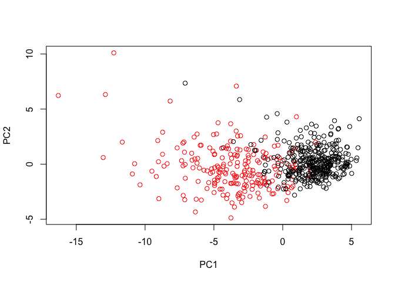
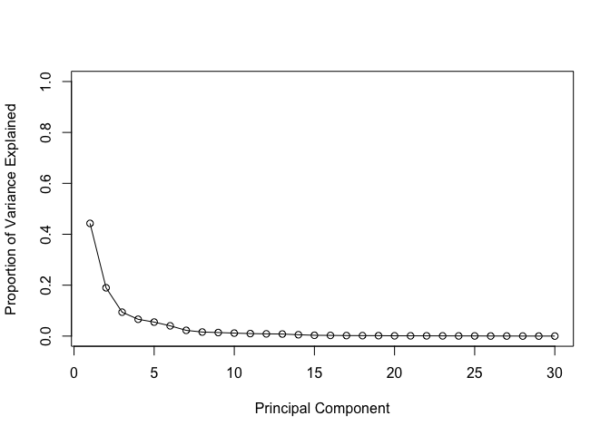
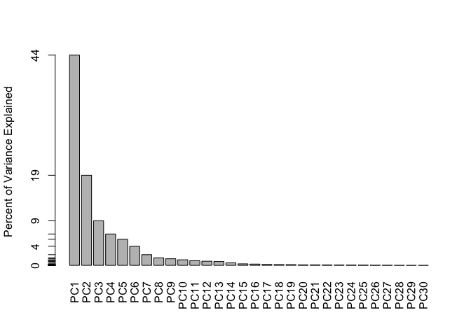
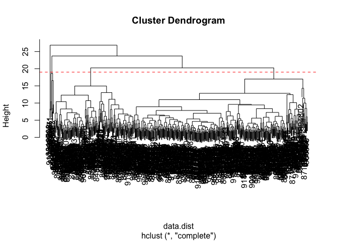
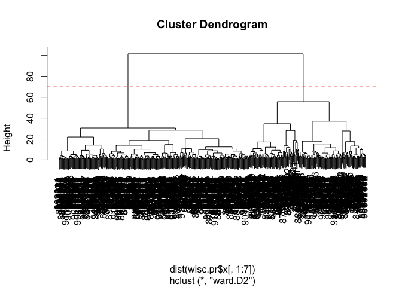
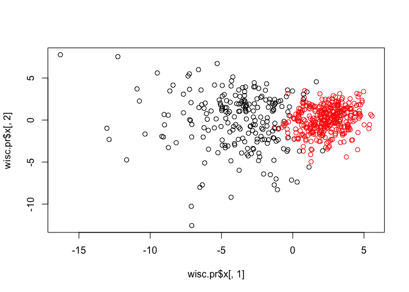
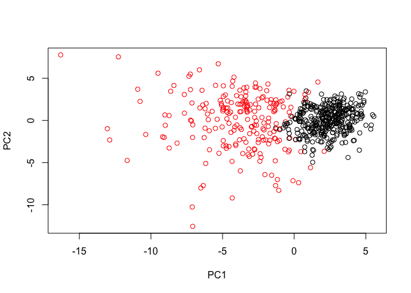
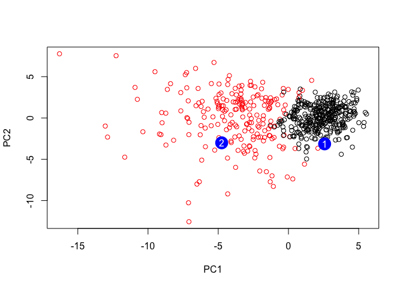

Lecture\_9\_Walkthrough
================
LQ
5/1/2019

``` r
wisc.df <- read.csv("WisconsinCancer.csv")
#View(wisc.df)
head(wisc.df)
```

    ##         id diagnosis radius_mean texture_mean perimeter_mean area_mean
    ## 1   842302         M       17.99        10.38         122.80    1001.0
    ## 2   842517         M       20.57        17.77         132.90    1326.0
    ## 3 84300903         M       19.69        21.25         130.00    1203.0
    ## 4 84348301         M       11.42        20.38          77.58     386.1
    ## 5 84358402         M       20.29        14.34         135.10    1297.0
    ## 6   843786         M       12.45        15.70          82.57     477.1
    ##   smoothness_mean compactness_mean concavity_mean concave.points_mean
    ## 1         0.11840          0.27760         0.3001             0.14710
    ## 2         0.08474          0.07864         0.0869             0.07017
    ## 3         0.10960          0.15990         0.1974             0.12790
    ## 4         0.14250          0.28390         0.2414             0.10520
    ## 5         0.10030          0.13280         0.1980             0.10430
    ## 6         0.12780          0.17000         0.1578             0.08089
    ##   symmetry_mean fractal_dimension_mean radius_se texture_se perimeter_se
    ## 1        0.2419                0.07871    1.0950     0.9053        8.589
    ## 2        0.1812                0.05667    0.5435     0.7339        3.398
    ## 3        0.2069                0.05999    0.7456     0.7869        4.585
    ## 4        0.2597                0.09744    0.4956     1.1560        3.445
    ## 5        0.1809                0.05883    0.7572     0.7813        5.438
    ## 6        0.2087                0.07613    0.3345     0.8902        2.217
    ##   area_se smoothness_se compactness_se concavity_se concave.points_se
    ## 1  153.40      0.006399        0.04904      0.05373           0.01587
    ## 2   74.08      0.005225        0.01308      0.01860           0.01340
    ## 3   94.03      0.006150        0.04006      0.03832           0.02058
    ## 4   27.23      0.009110        0.07458      0.05661           0.01867
    ## 5   94.44      0.011490        0.02461      0.05688           0.01885
    ## 6   27.19      0.007510        0.03345      0.03672           0.01137
    ##   symmetry_se fractal_dimension_se radius_worst texture_worst
    ## 1     0.03003             0.006193        25.38         17.33
    ## 2     0.01389             0.003532        24.99         23.41
    ## 3     0.02250             0.004571        23.57         25.53
    ## 4     0.05963             0.009208        14.91         26.50
    ## 5     0.01756             0.005115        22.54         16.67
    ## 6     0.02165             0.005082        15.47         23.75
    ##   perimeter_worst area_worst smoothness_worst compactness_worst
    ## 1          184.60     2019.0           0.1622            0.6656
    ## 2          158.80     1956.0           0.1238            0.1866
    ## 3          152.50     1709.0           0.1444            0.4245
    ## 4           98.87      567.7           0.2098            0.8663
    ## 5          152.20     1575.0           0.1374            0.2050
    ## 6          103.40      741.6           0.1791            0.5249
    ##   concavity_worst concave.points_worst symmetry_worst
    ## 1          0.7119               0.2654         0.4601
    ## 2          0.2416               0.1860         0.2750
    ## 3          0.4504               0.2430         0.3613
    ## 4          0.6869               0.2575         0.6638
    ## 5          0.4000               0.1625         0.2364
    ## 6          0.5355               0.1741         0.3985
    ##   fractal_dimension_worst  X
    ## 1                 0.11890 NA
    ## 2                 0.08902 NA
    ## 3                 0.08758 NA
    ## 4                 0.17300 NA
    ## 5                 0.07678 NA
    ## 6                 0.12440 NA

``` r
#Table uses the cross-classifying factors to build a contingency table of the counts at each combination of factor levels; $calls the diagnosis column from the dataframe
nrow(wisc.df)
```

    ## [1] 569

``` r
table(wisc.df$diagnosis)
```

    ## 
    ##   B   M 
    ## 357 212

``` r
colnames(wisc.df)
```

    ##  [1] "id"                      "diagnosis"              
    ##  [3] "radius_mean"             "texture_mean"           
    ##  [5] "perimeter_mean"          "area_mean"              
    ##  [7] "smoothness_mean"         "compactness_mean"       
    ##  [9] "concavity_mean"          "concave.points_mean"    
    ## [11] "symmetry_mean"           "fractal_dimension_mean" 
    ## [13] "radius_se"               "texture_se"             
    ## [15] "perimeter_se"            "area_se"                
    ## [17] "smoothness_se"           "compactness_se"         
    ## [19] "concavity_se"            "concave.points_se"      
    ## [21] "symmetry_se"             "fractal_dimension_se"   
    ## [23] "radius_worst"            "texture_worst"          
    ## [25] "perimeter_worst"         "area_worst"             
    ## [27] "smoothness_worst"        "compactness_worst"      
    ## [29] "concavity_worst"         "concave.points_worst"   
    ## [31] "symmetry_worst"          "fractal_dimension_worst"
    ## [33] "X"

``` r
length(grep(pattern = "_mean", colnames(wisc.df)))
```

    ## [1] 10

### Q5. Why do you think we are using the indices 3:32 here?

#### Because the id and diagnosis columns will not be used & the last column is NA (when the data went through excel, a space was accidentally input at some point yielding the weird X column filled with NA)

``` r
#Select cols 3:32 and store as a matrix
wisc.data <- as.matrix(wisc.df[,3:32])
#View(wisc.data)
```

``` r
# Set the row names of wisc.data
row.names(wisc.data) <- wisc.df$id
head(wisc.data)
```

    ##          radius_mean texture_mean perimeter_mean area_mean smoothness_mean
    ## 842302         17.99        10.38         122.80    1001.0         0.11840
    ## 842517         20.57        17.77         132.90    1326.0         0.08474
    ## 84300903       19.69        21.25         130.00    1203.0         0.10960
    ## 84348301       11.42        20.38          77.58     386.1         0.14250
    ## 84358402       20.29        14.34         135.10    1297.0         0.10030
    ## 843786         12.45        15.70          82.57     477.1         0.12780
    ##          compactness_mean concavity_mean concave.points_mean symmetry_mean
    ## 842302            0.27760         0.3001             0.14710        0.2419
    ## 842517            0.07864         0.0869             0.07017        0.1812
    ## 84300903          0.15990         0.1974             0.12790        0.2069
    ## 84348301          0.28390         0.2414             0.10520        0.2597
    ## 84358402          0.13280         0.1980             0.10430        0.1809
    ## 843786            0.17000         0.1578             0.08089        0.2087
    ##          fractal_dimension_mean radius_se texture_se perimeter_se area_se
    ## 842302                  0.07871    1.0950     0.9053        8.589  153.40
    ## 842517                  0.05667    0.5435     0.7339        3.398   74.08
    ## 84300903                0.05999    0.7456     0.7869        4.585   94.03
    ## 84348301                0.09744    0.4956     1.1560        3.445   27.23
    ## 84358402                0.05883    0.7572     0.7813        5.438   94.44
    ## 843786                  0.07613    0.3345     0.8902        2.217   27.19
    ##          smoothness_se compactness_se concavity_se concave.points_se
    ## 842302        0.006399        0.04904      0.05373           0.01587
    ## 842517        0.005225        0.01308      0.01860           0.01340
    ## 84300903      0.006150        0.04006      0.03832           0.02058
    ## 84348301      0.009110        0.07458      0.05661           0.01867
    ## 84358402      0.011490        0.02461      0.05688           0.01885
    ## 843786        0.007510        0.03345      0.03672           0.01137
    ##          symmetry_se fractal_dimension_se radius_worst texture_worst
    ## 842302       0.03003             0.006193        25.38         17.33
    ## 842517       0.01389             0.003532        24.99         23.41
    ## 84300903     0.02250             0.004571        23.57         25.53
    ## 84348301     0.05963             0.009208        14.91         26.50
    ## 84358402     0.01756             0.005115        22.54         16.67
    ## 843786       0.02165             0.005082        15.47         23.75
    ##          perimeter_worst area_worst smoothness_worst compactness_worst
    ## 842302            184.60     2019.0           0.1622            0.6656
    ## 842517            158.80     1956.0           0.1238            0.1866
    ## 84300903          152.50     1709.0           0.1444            0.4245
    ## 84348301           98.87      567.7           0.2098            0.8663
    ## 84358402          152.20     1575.0           0.1374            0.2050
    ## 843786            103.40      741.6           0.1791            0.5249
    ##          concavity_worst concave.points_worst symmetry_worst
    ## 842302            0.7119               0.2654         0.4601
    ## 842517            0.2416               0.1860         0.2750
    ## 84300903          0.4504               0.2430         0.3613
    ## 84348301          0.6869               0.2575         0.6638
    ## 84358402          0.4000               0.1625         0.2364
    ## 843786            0.5355               0.1741         0.3985
    ##          fractal_dimension_worst
    ## 842302                   0.11890
    ## 842517                   0.08902
    ## 84300903                 0.08758
    ## 84348301                 0.17300
    ## 84358402                 0.07678
    ## 843786                   0.12440

``` r
diagnosis <- wisc.df$diagnosis
```

PCA
---

``` r
colMeans(wisc.data)
```

    ##             radius_mean            texture_mean          perimeter_mean 
    ##            1.412729e+01            1.928965e+01            9.196903e+01 
    ##               area_mean         smoothness_mean        compactness_mean 
    ##            6.548891e+02            9.636028e-02            1.043410e-01 
    ##          concavity_mean     concave.points_mean           symmetry_mean 
    ##            8.879932e-02            4.891915e-02            1.811619e-01 
    ##  fractal_dimension_mean               radius_se              texture_se 
    ##            6.279761e-02            4.051721e-01            1.216853e+00 
    ##            perimeter_se                 area_se           smoothness_se 
    ##            2.866059e+00            4.033708e+01            7.040979e-03 
    ##          compactness_se            concavity_se       concave.points_se 
    ##            2.547814e-02            3.189372e-02            1.179614e-02 
    ##             symmetry_se    fractal_dimension_se            radius_worst 
    ##            2.054230e-02            3.794904e-03            1.626919e+01 
    ##           texture_worst         perimeter_worst              area_worst 
    ##            2.567722e+01            1.072612e+02            8.805831e+02 
    ##        smoothness_worst       compactness_worst         concavity_worst 
    ##            1.323686e-01            2.542650e-01            2.721885e-01 
    ##    concave.points_worst          symmetry_worst fractal_dimension_worst 
    ##            1.146062e-01            2.900756e-01            8.394582e-02

``` r
#apply(data,columns - 1 is rows, function)
apply(wisc.data,2,sd)
```

    ##             radius_mean            texture_mean          perimeter_mean 
    ##            3.524049e+00            4.301036e+00            2.429898e+01 
    ##               area_mean         smoothness_mean        compactness_mean 
    ##            3.519141e+02            1.406413e-02            5.281276e-02 
    ##          concavity_mean     concave.points_mean           symmetry_mean 
    ##            7.971981e-02            3.880284e-02            2.741428e-02 
    ##  fractal_dimension_mean               radius_se              texture_se 
    ##            7.060363e-03            2.773127e-01            5.516484e-01 
    ##            perimeter_se                 area_se           smoothness_se 
    ##            2.021855e+00            4.549101e+01            3.002518e-03 
    ##          compactness_se            concavity_se       concave.points_se 
    ##            1.790818e-02            3.018606e-02            6.170285e-03 
    ##             symmetry_se    fractal_dimension_se            radius_worst 
    ##            8.266372e-03            2.646071e-03            4.833242e+00 
    ##           texture_worst         perimeter_worst              area_worst 
    ##            6.146258e+00            3.360254e+01            5.693570e+02 
    ##        smoothness_worst       compactness_worst         concavity_worst 
    ##            2.283243e-02            1.573365e-01            2.086243e-01 
    ##    concave.points_worst          symmetry_worst fractal_dimension_worst 
    ##            6.573234e-02            6.186747e-02            1.806127e-02

``` r
round(apply(wisc.data,2,mean), 1)
```

    ##             radius_mean            texture_mean          perimeter_mean 
    ##                    14.1                    19.3                    92.0 
    ##               area_mean         smoothness_mean        compactness_mean 
    ##                   654.9                     0.1                     0.1 
    ##          concavity_mean     concave.points_mean           symmetry_mean 
    ##                     0.1                     0.0                     0.2 
    ##  fractal_dimension_mean               radius_se              texture_se 
    ##                     0.1                     0.4                     1.2 
    ##            perimeter_se                 area_se           smoothness_se 
    ##                     2.9                    40.3                     0.0 
    ##          compactness_se            concavity_se       concave.points_se 
    ##                     0.0                     0.0                     0.0 
    ##             symmetry_se    fractal_dimension_se            radius_worst 
    ##                     0.0                     0.0                    16.3 
    ##           texture_worst         perimeter_worst              area_worst 
    ##                    25.7                   107.3                   880.6 
    ##        smoothness_worst       compactness_worst         concavity_worst 
    ##                     0.1                     0.3                     0.3 
    ##    concave.points_worst          symmetry_worst fractal_dimension_worst 
    ##                     0.1                     0.3                     0.1

``` r
# Perform PCA on wisc.data by completing the following code
wisc.pr <- prcomp(wisc.data, scale = TRUE)
# Look at summary of results
#summary(wisc.pr)
plotwisc.pr <- biplot(wisc.pr)
```


### Q10. What stands out to you about this plot? Is it easy or difficult to understand? Why?

#### Eveything is too clumped

``` r
# Scatter plot observations by components 1 and 2
diagnosis <- wisc.df$diagnosis

plot(wisc.pr$x[,1], wisc.pr$x[,3], col = diagnosis, 
     xlab = "PC1", ylab = "PC2")
```



``` r
plot(wisc.pr$x[,1], wisc.pr$x[,3], col = diagnosis, 
     xlab = "PC1", ylab = "PC2")
```


``` r
# Calculate variance of each component
pr.var <- wisc.pr$sdev^2
head(pr.var)
```

    ## [1] 13.281608  5.691355  2.817949  1.980640  1.648731  1.207357

``` r
# Variance explained by each principal component: pve
pve <- pr.var / sum(pr.var)
pve
```

    ##  [1] 4.427203e-01 1.897118e-01 9.393163e-02 6.602135e-02 5.495768e-02
    ##  [6] 4.024522e-02 2.250734e-02 1.588724e-02 1.389649e-02 1.168978e-02
    ## [11] 9.797190e-03 8.705379e-03 8.045250e-03 5.233657e-03 3.137832e-03
    ## [16] 2.662093e-03 1.979968e-03 1.753959e-03 1.649253e-03 1.038647e-03
    ## [21] 9.990965e-04 9.146468e-04 8.113613e-04 6.018336e-04 5.160424e-04
    ## [26] 2.725880e-04 2.300155e-04 5.297793e-05 2.496010e-05 4.434827e-06

``` r
# Plot variance explained for each principal component
plot(pve, xlab = "Principal Component", 
     ylab = "Proportion of Variance Explained", 
     ylim = c(0, 1), type = "o")
```



``` r
# Alternative scree plot of the same data, note data driven y-axis
barplot(pve, ylab = "Percent of Variance Explained",
     names.arg=paste0("PC",1:length(pve)), las=2, axes = FALSE)
axis(2, at=pve, labels=round(pve,2)*100 )
```



#### install.packages("factoextra")

``` r
library("ggplot2")
library("factoextra")
```

    ## Welcome! Related Books: `Practical Guide To Cluster Analysis in R` at https://goo.gl/13EFCZ

``` r
## ggplot based graph
fviz_eig(wisc.pr, addlabels = TRUE)
```


``` r
wisc.pr$rotation[,1]
```

    ##             radius_mean            texture_mean          perimeter_mean 
    ##             -0.21890244             -0.10372458             -0.22753729 
    ##               area_mean         smoothness_mean        compactness_mean 
    ##             -0.22099499             -0.14258969             -0.23928535 
    ##          concavity_mean     concave.points_mean           symmetry_mean 
    ##             -0.25840048             -0.26085376             -0.13816696 
    ##  fractal_dimension_mean               radius_se              texture_se 
    ##             -0.06436335             -0.20597878             -0.01742803 
    ##            perimeter_se                 area_se           smoothness_se 
    ##             -0.21132592             -0.20286964             -0.01453145 
    ##          compactness_se            concavity_se       concave.points_se 
    ##             -0.17039345             -0.15358979             -0.18341740 
    ##             symmetry_se    fractal_dimension_se            radius_worst 
    ##             -0.04249842             -0.10256832             -0.22799663 
    ##           texture_worst         perimeter_worst              area_worst 
    ##             -0.10446933             -0.23663968             -0.22487053 
    ##        smoothness_worst       compactness_worst         concavity_worst 
    ##             -0.12795256             -0.21009588             -0.22876753 
    ##    concave.points_worst          symmetry_worst fractal_dimension_worst 
    ##             -0.25088597             -0.12290456             -0.13178394

``` r
wisc.pr$rotation["concave.points_mean",1]
```

    ## [1] -0.2608538

``` r
sort( abs(wisc.pr$rotation[,1]) )
```

    ##           smoothness_se              texture_se             symmetry_se 
    ##              0.01453145              0.01742803              0.04249842 
    ##  fractal_dimension_mean    fractal_dimension_se            texture_mean 
    ##              0.06436335              0.10256832              0.10372458 
    ##           texture_worst          symmetry_worst        smoothness_worst 
    ##              0.10446933              0.12290456              0.12795256 
    ## fractal_dimension_worst           symmetry_mean         smoothness_mean 
    ##              0.13178394              0.13816696              0.14258969 
    ##            concavity_se          compactness_se       concave.points_se 
    ##              0.15358979              0.17039345              0.18341740 
    ##                 area_se               radius_se       compactness_worst 
    ##              0.20286964              0.20597878              0.21009588 
    ##            perimeter_se             radius_mean               area_mean 
    ##              0.21132592              0.21890244              0.22099499 
    ##              area_worst          perimeter_mean            radius_worst 
    ##              0.22487053              0.22753729              0.22799663 
    ##         concavity_worst         perimeter_worst        compactness_mean 
    ##              0.22876753              0.23663968              0.23928535 
    ##    concave.points_worst          concavity_mean     concave.points_mean 
    ##              0.25088597              0.25840048              0.26085376

### Hierarchical clustering

#### hclust(dist(x))

``` r
# Scale the wisc.data data: data.scaled
data.scaled <- scale(wisc.data, scale = TRUE)
head(data.scaled)
```

    ##          radius_mean texture_mean perimeter_mean  area_mean
    ## 842302     1.0960995   -2.0715123      1.2688173  0.9835095
    ## 842517     1.8282120   -0.3533215      1.6844726  1.9070303
    ## 84300903   1.5784992    0.4557859      1.5651260  1.5575132
    ## 84348301  -0.7682333    0.2535091     -0.5921661 -0.7637917
    ## 84358402   1.7487579   -1.1508038      1.7750113  1.8246238
    ## 843786    -0.4759559   -0.8346009     -0.3868077 -0.5052059
    ##          smoothness_mean compactness_mean concavity_mean
    ## 842302         1.5670875        3.2806281     2.65054179
    ## 842517        -0.8262354       -0.4866435    -0.02382489
    ## 84300903       0.9413821        1.0519999     1.36227979
    ## 84348301       3.2806668        3.3999174     1.91421287
    ## 84358402       0.2801253        0.5388663     1.36980615
    ## 843786         2.2354545        1.2432416     0.86554001
    ##          concave.points_mean symmetry_mean fractal_dimension_mean
    ## 842302             2.5302489   2.215565542              2.2537638
    ## 842517             0.5476623   0.001391139             -0.8678888
    ## 84300903           2.0354398   0.938858720             -0.3976580
    ## 84348301           1.4504311   2.864862154              4.9066020
    ## 84358402           1.4272370  -0.009552062             -0.5619555
    ## 843786             0.8239307   1.004517928              1.8883435
    ##           radius_se texture_se perimeter_se    area_se smoothness_se
    ## 842302    2.4875451 -0.5647681    2.8305403  2.4853907    -0.2138135
    ## 842517    0.4988157 -0.8754733    0.2630955  0.7417493    -0.6048187
    ## 84300903  1.2275958 -0.7793976    0.8501802  1.1802975    -0.2967439
    ## 84348301  0.3260865 -0.1103120    0.2863415 -0.2881246     0.6890953
    ## 84358402  1.2694258 -0.7895490    1.2720701  1.1893103     1.4817634
    ## 843786   -0.2548461 -0.5921406   -0.3210217 -0.2890039     0.1562093
    ##          compactness_se concavity_se concave.points_se symmetry_se
    ## 842302       1.31570389    0.7233897        0.66023900   1.1477468
    ## 842517      -0.69231710   -0.4403926        0.25993335  -0.8047423
    ## 84300903     0.81425704    0.2128891        1.42357487   0.2368272
    ## 84348301     2.74186785    0.8187979        1.11402678   4.7285198
    ## 84358402    -0.04847723    0.8277425        1.14319885  -0.3607748
    ## 843786       0.44515196    0.1598845       -0.06906279   0.1340009
    ##          fractal_dimension_se radius_worst texture_worst perimeter_worst
    ## 842302             0.90628565    1.8850310   -1.35809849       2.3015755
    ## 842517            -0.09935632    1.8043398   -0.36887865       1.5337764
    ## 84300903           0.29330133    1.5105411   -0.02395331       1.3462906
    ## 84348301           2.04571087   -0.2812170    0.13386631      -0.2497196
    ## 84358402           0.49888916    1.2974336   -1.46548091       1.3373627
    ## 843786             0.48641784   -0.1653528   -0.31356043      -0.1149083
    ##          area_worst smoothness_worst compactness_worst concavity_worst
    ## 842302    1.9994782        1.3065367         2.6143647       2.1076718
    ## 842517    1.8888270       -0.3752817        -0.4300658      -0.1466200
    ## 84300903  1.4550043        0.5269438         1.0819801       0.8542223
    ## 84348301 -0.5495377        3.3912907         3.8899747       1.9878392
    ## 84358402  1.2196511        0.2203623        -0.3131190       0.6126397
    ## 843786   -0.2441054        2.0467119         1.7201029       1.2621327
    ##          concave.points_worst symmetry_worst fractal_dimension_worst
    ## 842302              2.2940576      2.7482041               1.9353117
    ## 842517              1.0861286     -0.2436753               0.2809428
    ## 84300903            1.9532817      1.1512420               0.2012142
    ## 84348301            2.1738732      6.0407261               4.9306719
    ## 84358402            0.7286181     -0.8675896              -0.3967505
    ## 843786              0.9050914      1.7525273               2.2398308

``` r
data.dist <- dist(data.scaled, method = "euclidean")
wisc.hclust <- hclust(data.dist, method = "complete" )
wisc.hclust
```

    ## 
    ## Call:
    ## hclust(d = data.dist, method = "complete")
    ## 
    ## Cluster method   : complete 
    ## Distance         : euclidean 
    ## Number of objects: 569

``` r
plot(wisc.hclust)
abline(h = 19, col = "red", lty = 2)
```



### One-liner:

``` r
wisc.hclust <- hclust(dist(scale(wisc.data)))
wisc.hclust.clusters <- cutree(wisc.hclust, k = 4)
##Can also cut at h = 19, k is the number of clusters
table(wisc.hclust.clusters)
```

    ## wisc.hclust.clusters
    ##   1   2   3   4 
    ## 177   7 383   2

``` r
table(wisc.hclust.clusters, diagnosis)
```

    ##                     diagnosis
    ## wisc.hclust.clusters   B   M
    ##                    1  12 165
    ##                    2   2   5
    ##                    3 343  40
    ##                    4   0   2

#### We don't need a readout for the individual arguments so it is called within one function

### Combining PCA with hclust

``` r
#90% capture or original variance in the dataset - PC1 - PC7
wisc.pr.hclust <- hclust(dist(wisc.pr$x[,1:7]), method = "ward.D2")
plot(wisc.pr.hclust)
abline(h = 70, col = "red", lty = 2)
```



``` r
grps <- cutree(wisc.pr.hclust, k=2)
table(grps)
```

    ## grps
    ##   1   2 
    ## 216 353

``` r
table(grps, diagnosis)
```

    ##     diagnosis
    ## grps   B   M
    ##    1  28 188
    ##    2 329  24

``` r
plot(wisc.pr$x[,1], wisc.pr$x[,2], col = grps)
```

 \#\#\#install.packages("rgl")

``` r
library(rgl)
newplot <- plot3d(wisc.pr$x[,1:3], xlab="PC 1", ylab="PC 2", zlab="PC 3", cex=1.5, size=1, type="s", col=grps)
print(newplot)
```

SECTION 7 - PREDICTIONS
-----------------------

``` r
url <- "https://tinyurl.com/new-samples-CSV"
new <- read.csv(url)
npc <- predict(wisc.pr, newdata=new)
npc
```

    ##            PC1       PC2        PC3        PC4       PC5        PC6
    ## [1,]  2.576616 -3.135913  1.3990492 -0.7631950  2.781648 -0.8150185
    ## [2,] -4.754928 -3.009033 -0.1660946 -0.6052952 -1.140698 -1.2189945
    ##             PC7        PC8       PC9       PC10      PC11      PC12
    ## [1,] -0.3959098 -0.2307350 0.1029569 -0.9272861 0.3411457  0.375921
    ## [2,]  0.8193031 -0.3307423 0.5281896 -0.4855301 0.7173233 -1.185917
    ##           PC13     PC14      PC15       PC16        PC17        PC18
    ## [1,] 0.1610764 1.187882 0.3216974 -0.1743616 -0.07875393 -0.11207028
    ## [2,] 0.5893856 0.303029 0.1299153  0.1448061 -0.40509706  0.06565549
    ##             PC19       PC20       PC21       PC22       PC23       PC24
    ## [1,] -0.08802955 -0.2495216  0.1228233 0.09358453 0.08347651  0.1223396
    ## [2,]  0.25591230 -0.4289500 -0.1224776 0.01732146 0.06316631 -0.2338618
    ##             PC25         PC26         PC27        PC28         PC29
    ## [1,]  0.02124121  0.078884581  0.220199544 -0.02946023 -0.015620933
    ## [2,] -0.20755948 -0.009833238 -0.001134152  0.09638361  0.002795349
    ##              PC30
    ## [1,]  0.005269029
    ## [2,] -0.019015820

``` r
g <- as.factor(grps)
levels(g)
```

    ## [1] "1" "2"

``` r
g <- relevel(g,2)
levels(g)
```

    ## [1] "2" "1"

``` r
# Plot using our re-ordered factor 
plot(wisc.pr$x[,1:2], col=g)
```



``` r
plot(wisc.pr$x[,1:2], col=g)
points(npc[,1], npc[,2], col="blue", pch=16, cex=3)
text(npc[,1], npc[,2], c(1,2), col="white")
```


